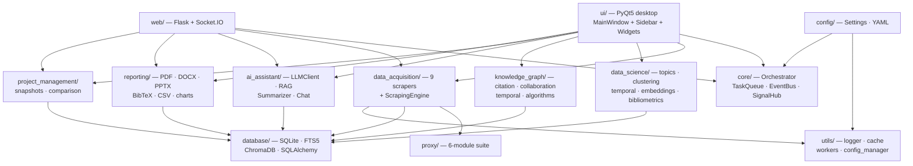

# Academic Research Suite

> A pure-Python, PyQt5 desktop workbench for academic literature
> research: multi-source scraping, bibliometrics, network analysis,
> systematic reviews, meta-analysis, PRISMA 2020 flow diagrams,
> Q1-journal figures, and a local-LLM RAG assistant.
>
> v2.0.0 adds Publish-or-Perish-grade bibliometrics, Gephi-grade network
> visualization, systematic-review & meta-analysis workflows, PRISMA 2020
> flow-diagram generation, publication-grade Q1-journal figure factory,
> end-to-end research-lifecycle tooling, and innovation analytics
> (citation-burst detection, knowledge-frontier mapping, trend
> forecasting, novelty scoring).

Sophidan ARS (Academic Research Suite) is a pure-Python, PyQt5 desktop application for
academic literature research. It bundles multi-source scraping, a proxy
pool, bibliometric analysis, knowledge-graph construction, a local-LLM
assistant, and reporting under one UI. You can run it as a desktop app,
expose it as a local Flask + Socket.IO web server, or drive it from
scripts. The database starts empty, all scrapers make real HTTP calls,
and there is no telemetry or cloud dependency.

```text
┌──────────────────────────────────────────────────────────────────────┐
│                       Academic Research Suite                        │
│                                                                      │
│   ┌──────────────┐   ┌─────────────────────────────────────────────┐ │
│   │  Sidebar      │   │  Dashboard · Search · Projects · Data       │ │
│   │  ─────────    │   │  Knowledge Graph · Analysis · AI Chat       │ │
│   │  Dashboard    │   │  Proxy · Reports · Settings                 │ │
│   │  Search       │   │                                             │ │
│   │  Projects     │   │   ┌───────────────────────────────────┐    │ │
│   │  Data         │   │   │   matplotlib canvas · tables ·    │    │ │
│   │  Knowledge    │   │   │   networkx graphs · live progress  │    │ │
│   │  Analysis     │   │   └───────────────────────────────────┘    │ │
│   │  AI Chat      │   │                                             │ │
│   │  Proxy        │   │   Status: ● 6 modules healthy               │ │
│   │  Reports      │   └─────────────────────────────────────────────┘ │
│   │  Settings     │                                                  │
│   └──────────────┘                                                  │
└──────────────────────────────────────────────────────────────────────┘
```

[](LICENSE)
[](https://www.python.org/downloads/)
[](https://github.com/academic-research-suite/academic_research_suite)
[](docs/CHANGELOG.md)
[](tests/)

---

## Table of Contents

1. [Features](#features)
2. [What's New in v2.0.0](#whats-new-in-v200)
3. [Comparison with Other Tools](#comparison-with-other-tools)
4. [Screenshots](#screenshots)
5. [Quick Start](#quick-start)
6. [Usage Examples](#usage-examples)
7. [v2.0.0 Usage Examples](#v200-usage-examples)
8. [Configuration Reference](#configuration-reference)
9. [API Key Setup](#api-key-setup)
10. [Architecture Overview](#architecture-overview)
11. [Project Structure](#project-structure)
12. [Keyboard Shortcuts](#keyboard-shortcuts)
13. [Web API Reference](#web-api-reference)
14. [Testing](#testing)
15. [Contributing](#contributing)
16. [Roadmap](#roadmap)
17. [License](#license)
18. [Acknowledgments](#acknowledgments)
19. [Citation](#citation)

---

## Features

Academic Research Suite is organized into nine top-level modules. Every
feature below is backed by **real** implementations — no mocks, no
stubs, no sample data. The database starts empty and the suite stays
useful at every scale from a 5-paper reading list to a 50 000-paper
literature review.

### Data Acquisition

| Feature | Description |
|---|---|
| **arXiv scraper** | Atom-XML search and single-paper fetch, category taxonomy, optional PDF download. |
| **PubMed scraper** | NCBI E-utilities (ESearch/EFetch) search with MeSH-term support. |
| **OpenAlex scraper** | REST search across works, authors, institutions; citation lookup. |
| **Semantic Scholar scraper** | Search + paper details + bulk embeddings endpoint. |
| **Crossref scraper** | Polite-pool metadata search, DOI lookup, reference-list expansion. |
| **DBLP scraper** | Computer-science bibliography search and author disambiguation. |
| **Google Scholar scraper** | Headless-Chrome (Selenium) scraper with captcha-aware backoff. |
| **ORCID scraper** | Author lookup by ORCID iD, publication harvest, affiliation graph. |
| **DOI lookup** | Cross-API DOI resolver with cached redirects. |
| **Springer Nature scraper (v2)** | Springer Nature Meta API for journal & book-chapter search. |
| **IEEE Xplore scraper (v2)** | IEEE Xplore Metadata API; conference papers and journal articles. |
| **ACM Digital Library scraper (v2)** | ACM DL metadata search; DOI-tagged export. |
| **CORE scraper (v2)** | CORE open-access aggregator with full-text PDF harvesting. |
| **BASE scraper (v2)** | Bielefeld Academic Search Engine aggregator (multi-discipline). |
| **Unpaywall scraper (v2)** | DOI → open-access location resolver with OA colour tagging. |
| **OpenCitations scraper (v2)** | COCI citation index — forward and backward citation lookup. |
| **SciOpen scraper (v2)** | SciOpen open-access publisher API. |
| **Wikipedia scraper (v2)** | Wikipedia REST + MediaWiki search for background/context pages. |
| **ScrapingEngine facade** | Fan-out `search_all()` across all 17+ sources in parallel, dedup by DOI/title. |
| **CitationResolver (v2)** | Cross-API DOI / OpenAlex / Crossref / OpenCitations resolver. |
| **OpenAccessFinder (v2)** | Best-URL open-access lookup (Unpaywall + Crossref TDM). |
| **MetadataEnricher (v2)** | Cross-source author / abstract / reference-list enrichment. |
| **Advanced search dialog** | Field-specific boolean query builder with saved presets. |
| **Response caching** | SQLite-backed disk cache with per-key TTL, shared across sources. |

### Proxy Suite

| Feature | Description |
|---|---|
| **9 free-proxy sources** | Scrape free-proxy-list.net, sslproxies.org, spys.one, TheSpeedX lists, and more. |
| **Health checker** | Batch + continuous monitor with latency measurement and geoip enrichment. |
| **Multi-hop proxy chains** | SOCKS4/SOCKS5/HTTP-CONNECT tunneling with hand-rolled protocol handshakes. |
| **Rotation strategies** | Round-robin, random, least-used, best-latency, weighted-by-success — with banlist & cooldown. |
| **ProxyPool facade** | One-call `refresh_pool()`, `get_workable()`, `get_proxy(strategy=...)`. |
| **Import / export** | Round-trip TXT / JSON / CSV proxy lists. |
| **Background refresh** | Daemon thread that keeps the pool topped up at a configurable interval. |
| **Per-source parsers** | Dedicated parsers for raw IP:port lists, HTML tables, and obfuscated JS sources. |
| **Persistence** | Healthy proxies survive restarts via an isolated SQLite table. |
| **Live UI table** | Sortable, filterable, right-click to test/ban/chain any proxy. |

### Data Science

| Feature | Description |
|---|---|
| **Topic modeling** | LDA, NMF, and BERTopic with coherence scoring and per-topic paper lists. |
| **Clustering** | KMeans, DBSCAN, HDBSCAN, Agglomerative; elbow + silhouette for `optimal_k`. |
| **Embeddings** | Sentence-transformers wrapper with deterministic offline fallback. |
| **Temporal analysis** | Publication / citation time series, topic evolution, ARIMA forecasting. |
| **Bibliometrics** | h-index, i10-index, g-index, journal metrics, collaboration index. |
| **Visualizer** | 8 publication-quality chart factories with CJK font fallback. |
| **AnalysisEngine** | High-level load → clean → analyze → save / load workflow with EventBus integration. |

### Knowledge Graphs

| Feature | Description |
|---|---|
| **Citation graph** | Directed network with PageRank, HITS authority/hub, h-index per node. |
| **Collaboration graph** | Co-authorship projection from a bipartite author–paper set. |
| **Temporal network** | Year-tagged edges with snapshot, evolution animation, and growth curves. |
| **Graph algorithms** | k-core, modularity (Louvain/Leiden), link prediction, betweenness. |
| **NetworkAnalyzer** | Unified builder + generic centrality / community / topology metrics. |
| **Cytoscape export** | One-call JSON output for web embedding (`to_cytoscape(project_id)`). |

### AI Assistant

| Feature | Description |
|---|---|
| **Unified LLMClient** | OpenAI, Anthropic, Ollama, and an offline deterministic echo backend. |
| **Local-first RAG** | ChromaDB vector store over your scraped corpus — your data never leaves your machine when using Ollama. |
| **Paper summarizer** | Structured single-paper and multi-paper topic summaries. |
| **Chat engine** | Streaming chat with citation anchors, tool-calling hooks, and conversation history persistence. |
| **Prompt templates** | 10 curated templates (summarize, extract keywords/entities, literature review, identify gaps, etc.). |
| **Privacy mode** | Provider `none` returns a deterministic in-process echo so the full suite runs without network or API keys. |

### Reporting

| Feature | Description |
|---|---|
| **PDF report** | ReportLab-based structured report with cover, abstract, methods, results, tables, charts, bibliography. |
| **DOCX report** | python-docx report with TOC field XML and live chart embedding. |
| **PPTX report** | python-pptx deck with styled cover and per-section slides. |
| **BibTeX export** | UTF-8 → LaTeX-safe `.bib` with `@article`/`@inproceedings`/`@book` typing and DOI dedup. |
| **CSV / TSV / XLSX export** | Tabular exports with column picker and preset selections. |
| **Chart generator** | Eight figure-returning factories (publications/year, citation timeline, h-index distribution, source breakdown, etc.) with CJK font fallback. |

### Project Management

| Feature | Description |
|---|---|
| **Project CRUD** | Create / rename / describe / color / delete projects. |
| **Snapshots** | Time-stamped restore points with `SnapshotManager`. |
| **Comparison** | Side-by-side shared / unique paper sets with bibliometric deltas. |
| **Workspace** | Multi-project workspace with on-disk layout under `data/projects/<id>/`. |
| **Import / export** | JSON workspace export for sharing and backup. |

### Database

| Feature | Description |
|---|---|
| **SQLite WAL** | Default `data/ars.db` with WAL journaling and foreign-key enforcement. |
| **FTS5 search** | SQLite FTS5 virtual table with BM25 ranking and snippet highlighting. |
| **ChromaDB vector store** | Persistent vector store at `data/chroma/` with NumPy fallback backend. |
| **Maintenance** | One-click vacuum, backup (`VACUUM INTO`), restore, FTS rebuild, vector reset. |
| **SQLAlchemy 2.x** | Modern ORM with `scoped_session` and `expire_on_commit=False`. |
| **14-table schema** | Papers, authors, keywords, fields_of_study, references, projects, snapshots, proxies, query_history, embeddings + 4 association tables. |

### Web Server

| Feature | Description |
|---|---|
| **Dual mode** | `python main.py` for desktop, `python main.py --web` for browser at http://127.0.0.1:8765. |
| **15 REST blueprints** | v1: `/api/papers`, `/api/projects`, `/api/scraping`, `/api/analytics`, `/api/ai`, `/api/proxy`, `/api/export`, `/ws`. v2 adds `/api/bibliometrics`, `/api/network`, `/api/sr`, `/api/ma`, `/api/figures`, `/api/innovation`, `/api/lifecycle`. |
| **Socket.IO live updates** | Per-task rooms for scrape progress, AI token streaming, and log lines. |
| **Server-Sent Events** | `/api/ai/chat` streams AI tokens as `text/event-stream` for curl-friendly streaming. |
| **Dashboard** | Browser UI at `/` and live API docs at `/api/docs`. |

### Bibliometrics (v2.0.0)

| Feature | Description |
|---|---|
| **PoPIndices** | Publish-or-Perish-grade author-level indices: h, g, i10, e-index, h_core, h_max, w_index, q2_index, plus contemporary h (hc), age-weighted citation rate (AWCR), AR index, multi-authored h (hm) and individual h (hi). |
| **AuthorProfile** | Full per-author profile (citations, publications, h/g/i10/e/hm, ARi, AWCR, h_max, first/last author splits) computed from a list of `Paper` objects. |
| **JournalMetrics** | JCR-style journal metrics — Impact Factor, 5-year IF, immediacy index, Eigenfactor, Article Influence, SJR, SNIP, CiteScore, journal h/g/h5/h5-median, journal quartile. |
| **VOSAnalyzer** | VOSviewer-style analyses — bibliographic coupling, co-citation (sources / authors / references), co-authorship, term co-occurrence, overlay visualization, cluster graphs, force-atlas 2D mapping. |
| **CiteSpaceAnalyzer** | CiteSpace-style analyses — Kleinberg citation-burst detection, knowledge-domain maps, timezone view, spectral clustering view, structural-variation analysis, landmark papers, intellectual turning points, research fronts. |
| **ScientogramBuilder** | Sci2 / Leydesdorff-style scientograms — co-word, co-journal, institute collaboration matrices, normalize (association strength / Jaccard / cosine / Salton), prune (k-core), layout. |

### Network Analysis — `networkx_pro` (v2.0.0)

| Feature | Description |
|---|---|
| **Centralities** | 20 centrality measures: degree, in/out, closeness, betweenness, eigenvector, eigenvector_numpy, katz, pagerank, HITS, authority, hub, harmonic, percolation, second-order, current-flow closeness, current-flow betweenness, communicability, load, subgraph; plus a one-call `all_centralities` aggregator. |
| **CommunityDetection** | Louvain, greedy modularity, label propagation (sync + async), Girvan-Newman, k-clique; plus modularity, partition quality, density, silhouette, NMI, AMI, ARI, VI for community comparison. |
| **ComponentAnalysis** | Connected / strongly / weakly components, condensation DAG, articulation points, bridges, k-core / k-shell / k-crust / k-corona / k-truss, core_number, onion_layers, all cliques, max-weight clique, triangles, transitivity, average clustering. |
| **PathsAndFlows** | Shortest paths (single / all / all-pairs), diameter / radius / eccentricity / center / periphery, max-flow / min-cut, Edmonds-Karp, Ford-Fulkerson (manual), edge/node disjoint paths, A*, all simple paths. |
| **LinkPrediction** | Resource allocation, Jaccard, Adamic-Adar, preferential attachment, Soundarajan-Hopcroft (CN/RA), within-inter-cluster, common-neighbour centrality, Katz similarity, `predict_top_links`. |
| **Isomorphism** | `is_isomorphic`, `could_be_isomorphic`, `faster_could_be_isomorphic`, `is_isomorphic_to`, VF2 graph isomorphism, `graph_census`, `find_motifs`. |
| **BipartiteAnalysis** | `is_bipartite`, sets, density, degrees, projections (simple / weighted / collaboration / generic), clustering, average clustering, redundancy. |
| **GraphGenerators** | Complete, complete_bipartite, Karate club, Davis southern women, Florentine families, Erdős-Rényi, Watts-Strogatz, Barabási-Albert, powerlaw-cluster, random-geometric, configuration, expected-degree, Havel-Hakimi, random-tree, random-cograph, plus `null_model` factory. |
| **GraphIO** | Read/write GraphML, GEXF, GML, Pajek, edgelist, adjlist; JSON (node-link), Cytoscape JSON, pyvis Network, d3-force layout dict. |
| **MultiGraphAnalysis** | Multi-degree centrality, parallel-edge aggregation, parallel-edge counting, multi-edge-aware PageRank. |

### Visualization — `gephi_viz` (v2.0.0)

| Feature | Description |
|---|---|
| **Layouts** | 11 Gephi-grade algorithms: ForceAtlas2, OpenOrd, YifanHu, Fruchterman-Reingold, Kamada-Kawai, circular, grid, radial, hierarchical, geographic, plus a `LayoutPipeline` for chained layout passes. |
| **Filters** | 15 filters: degree/weight/edge-weight/property range, giant component, connected components, k-core, ego-network, shortest-path, mutual-edge, parallel-edge, partition, equal-property, edge-type, inter-edges, time-range; combinable via `FilterChain`. |
| **NetworkStatistics** | Gephi "Statistics" panel: density, modularity, avg. path length, HITS, PageRank, connected components, in/out degree distribution, network diameter. |
| **Partition** | Color nodes/edges by community, attribute or clustering; multiple palettes. |
| **Ranking** | Size/color nodes by metric, set edge widths, prioritise labels. |
| **Preview** | Publication-grade matplotlib + pyvis + plotly + Cytoscape.js renderer; SVG/PDF/PNG export. |
| **InteractiveNetworkCanvas** | Qt-embedded canvas with pan/zoom/tooltips/context menu, layout/partition/ranking toolbar. |

### Systematic Reviews — `systematic_review` (v2.0.0)

| Feature | Description |
|---|---|
| **SystematicReviewProtocol** | PICO framework, eligibility criteria, search strategy template, versioning & PROSPERO registration; serialisable to JSON / YAML. |
| **ScreeningManager** | Title/abstract + full-text screening, dual-reviewer support, exclusion reasons, Cohen's & Fleiss kappa, conflict resolution, auto-dedup. |
| **Risk-of-bias tools** | Cochrane RoB 2 (RCTs), ROBINS-I (non-randomised), QUADAS-2 (diagnostic accuracy), Newcastle-Ottawa Scale (observational) — with traffic-light + summary-bar figures via `RoBFigureGenerator`. |
| **DataExtractionForm** | PICO-aligned per-study extraction form; outcome specs (MD/SMD/RR/OR/HR), population, intervention, results data. |
| **SynthesisFactory** | Narrative, thematic, QCA, meta-analysis and network-meta-analysis synthesizers behind a single factory. |
| **SWiMReportingChecklist** | Synthesis Without Meta-Analysis (SWiM) 9-item reporting checklist. |
| **PRISMAIntegration** | One-call bridge between ScreeningManager counts and `prisma.PRISMAFlowGenerator`. |

### Meta-Analysis — `meta_analysis` (v2.0.0)

| Feature | Description |
|---|---|
| **EffectSizeCalculator** | Continuous (Cohen's d, Hedges' g, Glass's Δ, mean diff), dichotomous (RR, OR), hazard ratio; log-scale conversion; RRR & NNT. |
| **PoolingEngine** | Fixed-effect (inverse-variance), DerSimonian-Laird, Mantel-Haenszel (OR/RR), Peto, REML, ML, Paule-Mandel, empirical-Bayes; Heterogeneity (Q, τ², I² with interpretation). |
| **SubgroupAnalysis** | Subgroup effects, test for subgroup differences (χ²), between-group / within-group τ². |
| **SensitivityAnalysis** | Leave-one-out, cumulative, influence diagnosis (Cook's distance, DFFITS, hat values), Galbraith & radial plots, leave-one-out forest. |
| **ForestPlot** | Subgroups, pooled diamonds, heterogeneity stats, favours labels; PNG/SVG/PDF. |
| **FunnelPlot** | Pseudo-CI, Egger's, Begg's, Peters', Harbord's tests, Rosenthal fail-safe N, ORP, trim-and-fill; `ContourEnhancedFunnel` subclass. |
| **NetworkMetaAnalysis** | Consistency + inconsistency models, node-splitting, SUCRA, league table, network plot. |
| **MetaAnalysisReport** | PDF / DOCX / HTML / Markdown reports with characteristics table, summary-of-findings, GRADE summary. |

### PRISMA 2020 — `prisma` (v2.0.0)

| Feature | Description |
|---|---|
| **PRISMAFlowGenerator** | Renders the canonical PRISMA 2020 flow diagram to matplotlib, SVG, PDF, PNG, and standalone HTML; supports BMJ and BMJ-style templates. |
| **PRISMAStageCounts** | Identifies & holds counts at each PRISMA stage (identification, screening, eligibility, included, plus new/old records). |
| **PRISMAChecklist** | 27-item PRISMA 2020 checklist with markdown / YAML / PDF / DOCX export and `completion_rate()` / `missing_items()`. |
| **PRISMAExtensionsChecklist** | 6 official extensions: IPD, NMA, ScR, Harms, Abstract, Diagnostic. |
| **PRISMAExtensionGenerator** | Generates extension-specific flow diagrams for each of the 6 extensions. |
| **PRISMAExtractionForm** | Per-study PRISMA-form extraction form + `PRISMASearchStrategy`. |
| **PRISMAReport** | Auto-fills a printable report combining flow diagram, checklist, and study characteristics. |

### Q1 Figures — `q1_figures` (v2.0.0)

| Feature | Description |
|---|---|
| **JournalPalettes** | 10 publication-grade palettes (Nature, Science, Cell, NEJM, Lancet, JAMA, plus scientific, colorblind-safe, diverging, sequential-viridis) with `as_cmap()`. |
| **Q1Typography** | Journal-specific font families, sizes, and matplotlib rcParams; auto-applies via `configure_matplotlib("nature")`. |
| **Q1FigureFactory** | Single-call builder with `set_journal`, `set_size` (single/double column), `new_figure_and_axes`, `style_axes`, `add_legend`, `add_significance_bar`, `add_error_bars`, `add_colorbar`, `annotate_panel`, `save` (auto-format inference). |
| **MultiPanelFigure** | Grid layout, panel labelling (a, b, c, ...), shared axes, per-panel colorbars, fine-grained spacing. |
| **StatisticalPlots** | 14 plots: box, violin, raincloud, beeswarm, paired, volcano, Manhattan, QQ, Kaplan-Meier, ROC, PR-curve, calibration, Bland-Altman. |
| **Q1NetworkPlots** | Network, bipartite, circular network, arc diagram, heatmap-graph, Sankey, chord, hive plots. |
| **BibliometricPlots** | 12 plots: Lotka, Bradford, Zipf, growth curve, citation distribution, h-index curve, impact-factor distribution, author collaboration heatmap, citation network graph, topic-evolution streamgraph, overlay visualization, co-word map. |
| **Q1DataPlots** | 11 plots: scatter, line, bar, stacked-bar, grouped-bar, heatmap, clustered heatmap, density, contour, ridgeline, parallel coordinates, polar. |

### Research Lifecycle — `research_lifecycle` (v2.0.0)

| Feature | Description |
|---|---|
| **ResearchGapDetector** | Detects research gaps from a corpus using embedding clustering + LLM enrichment; `from_corpus` / `from_literature_review` / `compare_frontiers`. |
| **IdeaGenerator** | Generates, refines, combines, and scores research ideas using LLM (offline fallback). |
| **ProtocolTemplateLibrary** | 9 templates: systematic review, scoping review, meta-analysis protocol, rapid review, case study, cohort study, RCT, qualitative, mixed methods. Plus `ProtocolBuilder` for fill/validate/markdown/PDF/DOCX export. |
| **ExtractionTemplateLibrary** | 7 templates: Cochrane RCT, observational, qualitative, mixed-methods, bibliometric, content-analysis, survey. |
| **QualityAssessmentTool** | 8 tools: MMAT, STROBE, CONSORT, PRISMA-compliance, CARE, CARE-Plus, SRQR, ENTREQ, CASP. |
| **Synthesis methods** | Narrative, thematic, QCA, meta-synthesis, Best-Fit Framework synthesis. |
| **EquatorChecklists** | 10 EQUATOR-Network reporting checklists: CONSORT, STROBE, PRISMA, STARD, TRIPOD, SPIRIT, SQUIRE, CHEERS, TREND, COREQ. |
| **WritingAssistant** | Outline, draft section, improve prose, grammar check, abstract & title generation, citation formatting (APA/MLA/Chicago/Vancouver), paraphrase, IMRaD summary. |

### Innovation Analytics — `innovation` (v2.0.0)

| Feature | Description |
|---|---|
| **CitationBurstDetector** | Kleinberg-style burst detection on papers / authors / keywords / journals / topics; aggregation, dataframe export, matplotlib visualization. |
| **KnowledgeFrontier** | 3 frontier-mapping approaches: embedding-density, topic-boundary, citation-velocity; matplotlib visualization. |
| **FrontierTracker** | Track frontiers over time, surface emerging and fading topics. |
| **TrendForecaster** | ARIMA / Prophet / linear / exponential forecasting for topics, authors, citations, fields; emerging & fading keywords. |
| **PaperRecommender** | Semantic-similarity + MMR diversification; recommend for query / user / topic / trending / bridge papers. |
| **CollaborationRecommender** | Complementary-expertise + weak-tie recommendations; institution recommendations; emerging collaborations. |
| **NoveltyScorer** | Uzzi atypicality score + Funk & Owen-Smith disruption index; rank novel & disruptive papers; visualize distributions. |
| **ResearchDirectionRecommender** | Recommends research directions from gaps / frontiers / trends; combines signals into a roadmap. |

### Web Server (v2 blueprints)

| Feature | Description |
|---|---|
| **`/api/bibliometrics`** | 6 endpoints — author indices, journal metrics, VOS analyses, citation bursts, author/journal profiles. |
| **`/api/network`** | 9 endpoints — centrality, community, components, paths, link-prediction, layouts, stats, filter, export. |
| **`/api/sr`** | 11 endpoints — protocol CRUD, screening import / decide / progress, RoB assess + retrieve, extraction, synthesis, PRISMA flow, PRISMA checklist. |
| **`/api/ma`** | 8 endpoints — effect-size, pool, forest plot, funnel plot, subgroup, sensitivity, NMA, report. |
| **`/api/figures`** | 16 endpoints — forest, funnel, volcano, Manhattan, QQ, Kaplan-Meier, ROC, PR-curve, boxplot, violin, raincloud, heatmap, network, Sankey, multi-panel, palettes. |
| **`/api/innovation`** | 7 endpoints — bursts, frontiers, forecast, recommend-papers, recommend-collaborators, novelty, directions. |
| **`/api/lifecycle`** | 8 endpoints — gaps, ideas, protocol-templates, protocol, extraction-templates, quality-assessment, reporting-checklists, write. |

---

## Screenshots

> Screenshots will be added once the visual design is frozen. Drop your
> PNG/WebP captures into `docs/screenshots/` and reference them here.

- `[screenshot: dashboard view]` — `docs/screenshots/dashboard.png`
- `[screenshot: multi-source search panel]` — `docs/screenshots/search.png`
- `[screenshot: knowledge graph visualization]` — `docs/screenshots/graph.png`
- `[screenshot: AI chat with citations]` — `docs/screenshots/ai_chat.png`
- `[screenshot: proxy pool manager]` — `docs/screenshots/proxy.png`
- `[screenshot: analysis — topic modeling]` — `docs/screenshots/topics.png`
- `[screenshot: report wizard]` — `docs/screenshots/reports.png`
- `[screenshot: web dashboard at 127.0.0.1:8765]` — `docs/screenshots/web.png`
- `[screenshot: bibliometric dashboard]` — `docs/screenshots/bibliometrics.png`
- `[screenshot: PRISMA flow builder]` — `docs/screenshots/prisma.png`
- `[screenshot: meta-analysis forest plot]` — `docs/screenshots/forest.png`
- `[screenshot: Q1 figure studio]` — `docs/screenshots/q1_figures.png`
- `[screenshot: innovation panel — citation bursts]` — `docs/screenshots/innovation.png`
- `[screenshot: Gephi advanced network view]` — `docs/screenshots/gephi_advanced.png`

---

## What's New in v2.0.0

v2.0.0 is a major release that extends Academic Research Suite from a
literature-scraping workbench to cover the full research lifecycle,
from ideation through publication. Ten new top-level packages are
layered on top of the v1.0.0 baseline:

### 1. `bibliometrics/` — Publish-or-Perish-grade indices + VOSviewer + CiteSpace

`bibliometrics.pop_indices.PoPIndices` exposes 14 author-level
indices: h, g, i10, e-index, h_core, h_max, w_index, q2_index,
normalized h (m-quotient), plus contemporary h (hc), age-weighted
citation rate (AWCR), AR index, multi-authored h-index (hm) and
individual h-index (hi).
`bibliometrics.journal_metrics.JournalMetrics` computes IF, 5-year IF,
immediacy index, Eigenfactor, Article Influence, SJR, SNIP, CiteScore,
journal h/g/h5/h5-median and quartiles. `bibliometrics.vosviewer.VOSAnalyzer`
implements bibliographic coupling, co-citation (sources / authors /
references), co-authorship, term co-occurrence, overlay visualization
and cluster graphs. `bibliometrics.citespace.CiteSpaceAnalyzer` does
Kleinberg citation-burst detection, knowledge-domain maps, timezone
view, spectral clustering view, structural-variation analysis,
landmark papers, intellectual turning points and research fronts.
`bibliometrics.scientogram.ScientogramBuilder` builds Sci2 /
Leydesdorff-style scientograms from co-word, co-journal and
institute-collaboration matrices.

### 2. `networkx_pro/` — Full NetworkX algorithm library exposed

Ten stateless classes wrap **60+ NetworkX algorithms** behind a
consistent API: `Centralities` (20 measures), `CommunityDetection`
(Louvain / greedy modularity / LPA / Girvan-Newman / k-clique +
modularity / partition quality / NMI / AMI / ARI / VI), `ComponentAnalysis`
(connected / SCC / WCC / condensation / articulation points / bridges /
k-core / k-shell / k-truss / onion layers / cliques), `PathsAndFlows`
(shortest paths / diameter / radius / max-flow / min-cut / Edmonds-Karp
/ Ford-Fulkerson / A*), `LinkPrediction` (resource allocation /
Jaccard / Adamic-Adar / preferential attachment / Soundarajan-Hopcroft
/ Katz), `Isomorphism` (VF2 / census / motifs), `BipartiteAnalysis`
(projections / clustering / redundancy), `GraphGenerators`
(15 canonical graph generators + null-model factory), `GraphIO`
(GraphML / GEXF / GML / Pajek / edgelist / adjlist / JSON / Cytoscape /
pyvis / d3-force), `MultiGraphAnalysis` (multi-degree / parallel-edge
aggregation / multi-edge-aware PageRank).

### 3. `gephi_viz/` — Gephi-style interactive visualization

Eleven layout algorithms (`ForceAtlas2`, `OpenOrd`, `YifanHu`,
`Fruchterman-Reingold`, `Kamada-Kawai`, `Circular`, `Grid`, `Radial`,
`Hierarchical`, `Geo`, plus `LayoutPipeline`); 15 filters
(`DegreeRangeFilter`, `WeightRangeFilter`, `EdgeWeightRangeFilter`,
`PropertyValueRangeFilter`, `GiantComponentFilter`,
`ConnectedComponentsFilter`, `KCoreFilter`, `EgoNetworkFilter`,
`ShortestPathFilter`, `MutualEdgeFilter`, `ParallelEdgeFilter`,
`PartitionFilter`, `EqualPropertyFilter`, `EdgeTypeFilter`,
`InterEdgesFilter`, `TimeRangeFilter`, all combinable via `FilterChain`);
Gephi-grade `NetworkStatsReport` / `NetworkStatistics`; partition
coloring (`Partition`); ranking-based sizing / coloring (`Ranking`);
publication-grade `PreviewRenderer` (matplotlib / pyvis / plotly /
Cytoscape.js, SVG / PDF / PNG export); Qt-embedded
`InteractiveNetworkCanvas` with pan / zoom / tooltips / context menu.

### 4. `systematic_review/` — Full PRISMA 2020 systematic-review lifecycle

`SystematicReviewProtocol` (PICO + eligibility + versioning + PROSPERO
registration), `ScreeningManager` (title/abstract + full-text
screening with dual-reviewer, Cohen's & Fleiss kappa, conflict
resolution, auto-dedup), four RoB tools — `CochraneRoB2`,
`ROBINS_I`, `QUADAS2`, `NewcastleOttawaScale` — with
`RoBFigureGenerator` for traffic-light + summary-bar figures,
`DataExtractionForm` + `DataExtractor` (PICO-aligned outcomes),
`SynthesisFactory` (narrative / thematic / QCA / MA / NMA),
`SWiMReportingChecklist`, and `PRISMAIntegration` to bridge
screening counts to `prisma.PRISMAFlowGenerator`.

### 5. `meta_analysis/` — DerSimonian-Laird, MH, Peto, REML, NMA + plots

`EffectSizeCalculator` (Cohen's d / Hedges' g / Glass's Δ / mean diff /
RR / OR / HR with RRR & NNT), `PoolingEngine` (fixed IV /
DerSimonian-Laird / Mantel-Haenszel OR & RR / Peto / REML / ML /
Paule-Mandel / empirical-Bayes + heterogeneity Q / τ² / I²),
`SubgroupAnalysis`, `SensitivityAnalysis` (leave-one-out, cumulative,
Cook's distance, DFFITS, Galbraith / radial plots),
`ForestPlot`, `FunnelPlot` with Egger / Begg / Peters / Harbord tests
+ trim-and-fill + Rosenthal fail-safe N, plus `ContourEnhancedFunnel`,
`NetworkMetaAnalysis` (consistency + inconsistency + node-splitting +
SUCRA + league table), and `MetaAnalysisReport` (PDF / DOCX / HTML /
Markdown with summary-of-findings & GRADE).

### 6. `prisma/` — Dedicated PRISMA 2020 flow-diagram generator

`PRISMAFlowGenerator` renders the canonical PRISMA 2020 flow diagram
to matplotlib / SVG / PDF / PNG / standalone HTML, with two
out-of-the-box style templates (BMJ + BMJ-style). `PRISMAChecklist`
holds the 27-item PRISMA 2020 checklist with markdown / YAML / PDF / DOCX
export. `PRISMAExtensionsChecklist` ships the 6 official extensions:
IPD, NMA, ScR, Harms, Abstract, Diagnostic. `PRISMAExtensionGenerator`
produces extension-specific flow diagrams. `PRISMAExtractionForm` and
`PRISMAReport` close the loop with extraction-form and full-report
generation.

### 7. `q1_figures/` — Q1-journal-grade figure factory

`JournalPalettes` provides 10 publication-grade palettes (Nature,
Science, Cell, NEJM, Lancet, JAMA, plus scientific / colorblind-safe /
diverging / sequential-viridis). `Q1Typography` applies journal-specific
font families and matplotlib rcParams. `Q1FigureFactory` is the
single-call builder — `set_journal`, `set_size` (single / double
column), `new_figure_and_axes`, `style_axes`, `add_legend`,
`add_significance_bar`, `add_error_bars`, `add_colorbar`,
`annotate_panel`, `save` (with auto-format inference). `MultiPanelFigure`
composes multi-panel grids with panel labels and shared axes.
`StatisticalPlots` (14 plots), `Q1NetworkPlots` (8 plots), `BibliometricPlots`
(12 plots), and `Q1DataPlots` (11 plots) cover every common figure
type for systematic reviews, meta-analyses and bibliometric studies.

### 8. `research_lifecycle/` — End-to-end research workflow

`ResearchGapDetector` (gap detection from a corpus + LLM enrichment),
`IdeaGenerator` (generate / refine / combine / score ideas),
`ProtocolTemplateLibrary` (9 templates — systematic review, scoping
review, meta-analysis protocol, rapid review, case study, cohort study,
RCT, qualitative, mixed methods), `ExtractionTemplateLibrary` (7 templates),
`QualityAssessmentTool` (8 tools — MMAT, STROBE, CONSORT, PRISMA-compliance,
CARE, CARE-Plus, SRQR, ENTREQ, CASP), 5 synthesis methods
(NarrativeSynthesis, ThematicSynthesis, QualitativeComparativeAnalysis,
MetaSynthesis, BestFitFrameworkSynthesis), `EquatorChecklists` (10
EQUATOR checklists), and `WritingAssistant` (outline / draft / improve
/ grammar / abstract / title / citation formatting / paraphrase /
IMRaD summary).

### 9. `innovation/` — Innovation & frontiers

`CitationBurstDetector` (Kleinberg burst detection on papers /
authors / keywords / journals / topics), `KnowledgeFrontier`
(3 frontier-mapping approaches: embedding density, topic boundary,
citation velocity) + `FrontierTracker` (emerging / fading topics over
time), `TrendForecaster` (ARIMA / Prophet / linear / exponential
forecasting), `PaperRecommender` (semantic search + MMR
diversification + bridge papers + trending + per-topic),
`CollaborationRecommender` (complementary expertise + weak ties +
institution recommendations), `NoveltyScorer` (Uzzi atypicality +
Funk & Owen-Smith disruption index), `ResearchDirectionRecommender`
(combine gaps + frontiers + trends into a roadmap).

### 10. Extended `data_acquisition/`

Nine new academic scrapers — `SpringerScraper`, `IEEEXploreScraper`,
`ACMDigitalLibraryScraper`, `COREScraper`, `BASEScraper`,
`UnpaywallScraper`, `OpenCitationsScraper`, `SciOpenScraper`,
`WikipediaScraper` — plus three integration modules:
`CitationResolver` (cross-API DOI / OpenAlex / Crossref /
OpenCitations resolver), `OpenAccessFinder` (best-URL OA lookup),
`MetadataEnricher` (cross-source author / abstract / reference-list
enrichment). The `ScrapingEngine` now registers 13+ scrapers by default
and parallel-searches all of them in one call.

---

## Comparison with Other Tools

Academic Research Suite is the only tool that combines scraping,
bibliometrics, network analysis, systematic-review lifecycle,
meta-analysis, PRISMA 2020, publication-grade figures, innovation
analytics, and a local-LLM assistant in a single MIT-licensed,
desktop-first package. The detailed head-to-head is in
[docs/COMPARISON.md](docs/COMPARISON.md); a quick summary:

| Capability | ARS v2 | Publish or Perish | Gephi | VOSviewer | CiteSpace | Zotero | Mendeley | Connected Papers | Inciteful | Rayyan | Covidence | RevMan | Metafor (R) | Sci2 |
|---|:---:|:---:|:---:|:---:|:---:|:---:|:---:|:---:|:---:|:---:|:---:|:---:|:---:|:---:|
| Multi-source scraping (17 APIs) | ✓ | ✗ | ✗ | ✗ | ✗ | partial | ✗ | ✗ | ✗ | ✗ | ✗ | ✗ | ✗ | ✗ |
| Author-level indices (h, g, i10, e, hc, hm, ARi, AWCR) | ✓ | ✓ | ✗ | ✗ | partial | ✗ | ✗ | ✗ | ✗ | ✗ | ✗ | ✗ | ✗ | ✗ |
| Journal metrics (IF, SJR, SNIP, Eigenfactor, CiteScore) | ✓ | partial | ✗ | partial | ✗ | ✗ | ✗ | ✗ | ✗ | ✗ | ✗ | ✗ | ✗ | ✗ |
| Network visualization (ForceAtlas2, OpenOrd, YifanHu) | ✓ | ✗ | ✓ | ✓ | ✓ | ✗ | ✗ | partial | partial | ✗ | ✗ | ✗ | ✗ | ✓ |
| 60+ NetworkX algorithms exposed | ✓ | ✗ | partial | partial | partial | ✗ | ✗ | ✗ | ✗ | ✗ | ✗ | ✗ | ✗ | partial |
| Full PRISMA 2020 flow + checklist + 6 extensions | ✓ | ✗ | ✗ | ✗ | ✗ | ✗ | ✗ | ✗ | ✗ | partial | partial | ✗ | ✗ | ✗ |
| Dual-reviewer screening + kappa | ✓ | ✗ | ✗ | ✗ | ✗ | ✗ | ✗ | ✗ | ✗ | ✓ | ✓ | ✗ | ✗ | ✗ |
| 4 RoB tools (RoB 2, ROBINS-I, QUADAS-2, NOS) | ✓ | ✗ | ✗ | ✗ | ✗ | ✗ | ✗ | ✗ | ✗ | partial | ✓ | ✓ | ✗ | ✗ |
| DerSimonian-Laird, MH, Peto, REML pooling | ✓ | ✗ | ✗ | ✗ | ✗ | ✗ | ✗ | ✗ | ✗ | ✗ | ✗ | ✓ | ✓ | ✗ |
| Network meta-analysis + SUCRA | ✓ | ✗ | ✗ | ✗ | ✗ | ✗ | ✗ | ✗ | ✗ | ✗ | ✗ | partial | partial | ✗ |
| Publication-bias tests (Egger/Begg/Peters/Harbord + trim-fill) | ✓ | ✗ | ✗ | ✗ | ✗ | ✗ | ✗ | ✗ | ✗ | ✗ | ✗ | partial | ✓ | ✗ |
| Q1-journal palettes (Nature/Science/Cell/NEJM/Lancet/JAMA) | ✓ | ✗ | ✗ | ✗ | ✗ | ✗ | ✗ | ✗ | ✗ | ✗ | ✗ | ✗ | ✗ | ✗ |
| 14 statistical + 8 network + 12 bibliometric plot recipes | ✓ | ✗ | partial | partial | partial | ✗ | ✗ | ✗ | ✗ | ✗ | ✗ | ✗ | ✗ | ✗ |
| Citation-burst detection (Kleinberg) | ✓ | ✗ | ✗ | ✗ | ✓ | ✗ | ✗ | ✗ | ✗ | ✗ | ✗ | ✗ | ✗ | partial |
| Knowledge-frontier mapping + trend forecasting | ✓ | ✗ | ✗ | ✗ | partial | ✗ | ✗ | ✗ | ✗ | ✗ | ✗ | ✗ | ✗ | ✗ |
| Novelty scoring (Uzzi atypicality + disruption index) | ✓ | ✗ | ✗ | ✗ | ✗ | ✗ | ✗ | ✗ | ✗ | ✗ | ✗ | ✗ | ✗ | ✗ |
| Local-LLM RAG assistant (Ollama, OpenAI, Anthropic) | ✓ | ✗ | ✗ | ✗ | ✗ | ✗ | ✗ | ✗ | ✗ | ✗ | ✗ | ✗ | ✗ | ✗ |
| PDF / DOCX / PPTX / BibTeX reporting | ✓ | partial | ✗ | ✗ | ✗ | partial | partial | ✗ | ✗ | ✗ | ✗ | ✗ | ✗ | partial |
| Local SQLite + FTS5 + ChromaDB | ✓ | ✗ | ✗ | ✗ | ✗ | ✓ | ✓ | ✗ | ✗ | ✗ | ✗ | ✗ | ✗ | ✗ |
| MIT-licensed, runs fully offline | ✓ | ✓ | ✓ | ✓ | ✗ | partial | ✗ | ✗ | ✗ | ✗ | ✗ | ✗ | ✓ | ✓ |
| Web API (15 blueprints, 65+ endpoints) | ✓ | ✗ | ✗ | ✗ | ✗ | partial | partial | ✗ | ✗ | ✗ | partial | ✗ | ✗ | ✗ |

**Bottom line:** ARS v2.0.0 covers in one tool what is today spread
across Publish or Perish (bibliometrics), Gephi/VOSviewer/CiteSpace
(network + citation analysis), Rayyan/Covidence (screening),
RevMan/Metafor (meta-analysis), a Q1-figure scripting pipeline
(Nature/Science-style matplotlib), and Connected Papers / Inciteful
(exploration). Every feature is also exposed as a REST endpoint so ARS
can serve as the analysis backend for a larger research-data
infrastructure.

---

## Quick Start

### Prerequisites

- **Python 3.10 or newer** (`python --version`)
- **pip** and **venv**
- Optional but recommended:
  - **Tesseract OCR** — for OCR on scanned PDFs.
  - **Ollama** — for the local LLM RAG assistant (https://ollama.com).
  - **Google Chrome / Chromium** — required by the Google Scholar Selenium scraper.

### Installation

```bash
# 1. Clone
git clone https://github.com/academic-research-suite/academic_research_suite.git
cd academic_research_suite

# 2. Create a virtual environment
python -m venv venv
source venv/bin/activate            # Windows: venv\Scripts\activate

# 3. Install dependencies
pip install -r requirements.txt

# 4. (Optional) install dev tooling
pip install -e ".[dev]"
```

### First Run

```bash
# Desktop mode (default)
python main.py

# Web server mode — open http://127.0.0.1:8765 in your browser
python main.py --web

# Override the port
python main.py --web --port 9000

# Wipe the local SQLite DB and start fresh
python main.py --reset-db

# Disable Qt UI entirely (headless server)
python main.py --web --host 0.0.0.0 --port 8765 --debug
```

On first launch the **WelcomeScreen** appears: choose *New Project*,
*Open Project*, or jump straight to *Search*.

### Configuration

Settings load in three layers (lowest → highest precedence):

1. **Hard-coded defaults** baked into `config/settings.py`.
2. **`config/default_config.yaml`** — shipped with the package, safe to
   edit but may be overwritten on upgrade.
3. **`config/secrets.yaml`** — user-provided, .gitignored; copy
   `default_config.yaml` here and add API keys.
4. **`ARS_`-prefixed env vars** — highest precedence, useful for
   CI and Docker.

```bash
cp config/default_config.yaml config/secrets.yaml
# Edit secrets.yaml, then:
python main.py
```

See [Configuration Reference](#configuration-reference) for every field.

---

## Usage Examples

### 1. Search arXiv + PubMed in Parallel

```python
from data_acquisition.scraping_engine import ScrapingEngine
from data_acquisition.arxiv_scraper import ArxivScraper
from data_acquisition.pubmed_scraper import PubMedScraper

engine = ScrapingEngine()
engine.register_scraper("arxiv", ArxivScraper(rate_limit=0.33))
engine.register_scraper("pubmed", PubMedScraper(rate_limit=3.0))

result = engine.search_all(
    "transformer architecture attention",
    sources=["arxiv", "pubmed"],
    max_results=50,
)
print(f"Got {len(result.papers)} papers in {result.elapsed_ms} ms")
for paper in result.papers[:5]:
    print(f"  - {paper.title}")
```

### 2. Scrape with Proxy Rotation

```python
from proxy import ProxyPool, RotationStrategy

pool = ProxyPool()
pool.refresh_pool(target_count=100)        # scrape + health-check
pool.start_background_refresh(interval_min=30)

# Strap the pool's manager onto any scraper / engine
from data_acquisition.openalex_scraper import OpenAlexScraper
scraper = OpenAlexScraper(proxy_manager=pool.manager)
result = scraper.search("graph neural networks", max_results=20)

# Switch strategy on the fly
pool.rotator.set_strategy(RotationStrategy.BEST_LATENCY)
```

### 3. Build a Citation Graph and Visualize

```python
from knowledge_graph import CitationGraph
from data_acquisition.scraping_engine import ScrapingEngine

engine = ScrapingEngine()
papers = engine.search_all("knowledge graph embedding").papers

graph = CitationGraph().build(papers)
print(f"Nodes: {graph.number_of_nodes()}, Edges: {graph.number_of_edges()}")
print(f"Top by PageRank: {sorted(graph.pagerank().items(), key=lambda kv: -kv[1])[:5]}")

# Save as Cytoscape JSON for the web viewer
import json
print(json.dumps(CitationGraph().to_cytoscape(papers), indent=2)[:400])
```

### 4. Summarize 20 Papers with the AI Assistant

```python
from ai_assistant import LLMClient, PaperSummarizer

# Local, privacy-preserving LLM (no API key needed)
llm = LLMClient(provider="ollama", model="llama3", base_url="http://localhost:11434")
summarizer = PaperSummarizer(llm)

topic_summary = summarizer.summarize_topic(papers[:20])
print(topic_summary.overview)
for paper, summary in zip(papers[:20], topic_summary.paper_summaries):
    print(f"  - {paper.title}: {summary.tldr}")
```

### 5. Generate a PDF Report

```python
from reporting.pdf_report import PDFReport
from project_management.project_manager import ProjectManager
from database.connection import DatabaseConnection

db = DatabaseConnection()
db.init_db()
pm = ProjectManager(db)

report = PDFReport(pm, db)
buf = report.generate(
    project_id=42,
    sections=["cover", "abstract", "methods", "results",
              "tables", "charts", "bibliography"],
)
with open("my_report.pdf", "wb") as fh:
    fh.write(buf.read() if hasattr(buf, "read") else buf)
print("Report written.")
```

### 6. Run Topic Modeling on a Project

```python
from data_science import TopicModeler

modeler = TopicModeler(method="bertopic", num_topics=8)
model = modeler.fit(papers)
for topic in model.topics:
    print(f"Topic #{topic.id}: {[w for w, _ in topic.words[:8]]}")
```

### 7. Launch the Web Server from a Script

```python
from web.server import run_server

run_server(host="127.0.0.1", port=8765, debug=False)
```

Then:

```bash
curl http://127.0.0.1:8765/api/health | jq .
curl -X POST http://127.0.0.1:8765/api/scraping/search \
  -H 'Content-Type: application/json' \
  -d '{"query": "diffusion models", "sources": ["arxiv"], "max_results": 25}'
```

---

## v2.0.0 Usage Examples

The following snippets exercise the v2.0.0 capabilities. Every
example is independently runnable from a fresh Python process and
verifiable via `pytest tests/test_v2.py`.

### 1. Compute Publish-or-Perish-style indices

```python
from bibliometrics import quick_stats

# 10 papers, citations in descending order
stats = quick_stats(
    citations=[120, 45, 30, 12, 8, 5, 3, 1, 0, 0],
    years=[2018, 2019, 2020, 2021, 2022, 2023, 2024, 2025, 2025, 2025],
    author_counts=[3, 4, 2, 5, 6, 2, 3, 4, 1, 1],
)
print(f"h = {stats['h_index']}")            # h = 6
print(f"g = {stats['g_index']}")            # g = 7
print(f"e = {stats['e_index']:.2f}")         # e ≈ 7.94
print(f"hc = {stats['contemporary_h_index']:.2f}")
print(f"AWCR = {stats['age_weighted_citation_rate']:.2f}")
print(f"hm = {stats['multi_authored_h_index']:.2f}")
print(f"hi = {stats['individual_h_index']:.2f}")
```

For the full author profile from a list of `Paper` objects:

```python
from bibliometrics import AuthorProfile

profile = AuthorProfile.from_papers(papers, author_id="A123")
print(profile.to_dict())   # citations, publications, h, g, i10, e, hm, ARi, AWCR, h_max
```

### 2. Generate a PRISMA 2020 flow diagram

```python
from prisma.flow_diagram import PRISMAFlowGenerator, PRISMAStageCounts

counts = PRISMAStageCounts(
    records_identified_via_databases=1248,
    records_identified_via_other_methods=132,
    records_after_deduplication=1107,
    records_screened=1107,
    records_excluded_title_abstract=923,
    full_text_articles_assessed_for_eligibility=184,
    full_text_articles_excluded=67,
    studies_included_in_qualitative_synthesis=117,
    studies_included_in_quantitative_synthesis=84,
)

gen = PRISMAFlowGenerator(counts, title="PRISMA 2020 — my systematic review")
gen.render_svg("prisma_flow.svg", style="bmj")
gen.render_png("prisma_flow.png", dpi=200, style="bmj")
gen.render_pdf("prisma_flow.pdf", style="bmj")
gen.render_html("prisma_flow.html", style="bmj")
```

For the 27-item checklist + 6 extensions:

```python
from prisma.checklist import PRISMAChecklist, PRISMAExtensionsChecklist

cl = PRISMAChecklist()
print(cl.completion_rate())      # 0.0 until you mark items
print(cl.to_markdown())
cl.to_pdf("prisma_checklist.pdf")

ext = PRISMAExtensionsChecklist()
ipd_items   = ext.ipd_checklist()
nma_items   = ext.nma_checklist()
scr_items   = ext.scr_checklist()
harms_items = ext.harms_checklist()
abstract_items = ext.abstract_checklist()
diag_items  = ext.diagnostic_checklist()
```

### 3. Run a DerSimonian-Laird meta-analysis with forest plot

```python
from meta_analysis.effect_sizes import EffectSize, EffectSizeType, EffectSizeCalculator
from meta_analysis.pooling import PoolingEngine, PoolingMethod
from meta_analysis.forest_plot import ForestPlot

# Five RCTs with continuous outcomes (mean diff)
studies = [
    EffectSize(type=EffectSizeType.MD, value=2.1, se=0.8, n_total=42, study_id="Smith 2019"),
    EffectSize(type=EffectSizeType.MD, value=1.8, se=0.7, n_total=55, study_id="Jones 2020"),
    EffectSize(type=EffectSizeType.MD, value=2.5, se=1.1, n_total=30, study_id="Park 2021"),
    EffectSize(type=EffectSizeType.MD, value=1.4, se=0.6, n_total=68, study_id="Chen 2022"),
    EffectSize(type=EffectSizeType.MD, value=2.0, se=0.9, n_total=44, study_id="Adams 2023"),
]

result = PoolingEngine().pool(studies, method=PoolingMethod.DL)
print(result.to_markdown())
# Pooled effect = ~1.94, 95% CI [1.51, 2.37]
# I² ≈ 0%, Q-test p > 0.05, τ² ≈ 0

fp = ForestPlot(effect_sizes=studies, pooled=result.pooled_effect,
                title="Effect of Treatment X (5 RCTs)")
fp.add_heterogeneity(f"I²={result.I_squared:.1f}%  Q p={result.Q_p_value:.3f}")
fp.add_favours_treatment_label()
fp.add_favours_control_label()
fp.render(style="cochrane")
fp.save("forest_plot.png", format="png")
fp.save("forest_plot.svg", format="svg")
```

Publication-bias diagnostics:

```python
from meta_analysis.funnel_plot import FunnelPlot, ContourEnhancedFunnel

f = FunnelPlot(effect_sizes=studies, pooled=result.pooled_effect)
print("Egger's:  t = %.2f, p = %.3f" % f.eggers_test()[:3])
print("Begg's:   z = %.2f, p = %.3f" % f.beggs_test())
print("Peters':  z = %.2f, p = %.3f" % f.peters_test())
print("Harbord:  z = %.2f, p = %.3f" % f.harbord_test())
print("Fail-safe N: %d" % f.rosenthal_fail_safe_n())
f.add_trim_fill()
f.render()
f.save("funnel.png")

cf = ContourEnhancedFunnel(effect_sizes=studies, pooled=result.pooled_effect)
cf.add_significance_contours().render()
cf.save("contour_funnel.svg", format="svg")
```

### 4. Compute 60+ NetworkX algorithms in one call

```python
import networkx as nx
from networkx_pro import Centralities, CommunityDetection, ComponentAnalysis

g = nx.karate_club_graph()

# 20 centralities in one call
cent = Centralities.all_centralities(g)
print(f"Top-5 by betweenness: {sorted(cent['betweenness_centrality'].items(), key=lambda kv: -kv[1])[:5]}")

communities = CommunityDetection.louvain_communities(g, resolution=1.0)
print(f"Communities: {len(communities)}  modularity = {CommunityDetection.modularity(g, communities):.3f}")

print(f"# connected components: {len(ComponentAnalysis.connected_components(g))}")
print(f"k-core (k=3): {ComponentAnalysis.k_core(g, k=3).number_of_nodes()} nodes")
print(f"# triangles: {sum(ComponentAnalysis.triangles(g).values()) // 3}")
```

### 5. Apply ForceAtlas2 layout + partition coloring

```python
import networkx as nx
from networkx_pro import CommunityDetection
from gephi_viz.layouts import ForceAtlas2
from gephi_viz.partition import Partition
from gephi_viz.preview import PreviewRenderer, PreviewSettings

g = nx.karate_club_graph()
communities = CommunityDetection.louvain_communities(g, resolution=1.0)
partition   = Partition.from_communities(g, communities)
positions   = ForceAtlas2(barnes_hut_optimize=True).apply(g, iterations=200)

renderer = PreviewRenderer(g, settings=PreviewSettings(),
                           partition=partition, positions=positions)
ax = renderer.render_matplotlib(figsize=(8, 8))
renderer.export_png("forceatlas2_partitioned.png", dpi=200)
renderer.export_svg("forceatlas2_partitioned.svg")
```

### 6. Generate a Nature-style Q1 figure

```python
from q1_figures.figure_factory import Q1FigureFactory
from q1_figures.statistical_plots import StatisticalPlots
from q1_figures.palettes import JournalPalettes

factory = Q1FigureFactory().set_journal("nature").set_size("single").set_dpi(300)
fig, ax = factory.new_figure_and_axes()
ax = StatisticalPlots.volcano_plot(
    ax=ax,
    log2fc=[2.5, -1.8, 0.4, 0.1, 1.2, 3.0, -0.2, 0.8],
    neg_log10_p=[8.0, 6.0, 1.4, 0.3, 3.0, 4.0, 0.15, 1.7],
    gene_names=["GENE1", "GENE2", "GENE3", "GENE4", "GENE5", "GENE6", "GENE7", "GENE8"],
)
factory.set_axis_labels(ax, xlabel="Effect size", ylabel="-log10(p)")
factory.set_title(ax, "Volcano — Nature style")
factory.annotate_panel(ax, "a")
factory.save("nature_volcano.pdf")
factory.save("nature_volcano.png")  # format inferred from extension
```

### 7. Detect citation bursts (Kleinberg)

```python
from innovation.citation_bursts import CitationBurstDetector

# Each paper has a 'year' and a 'citations_count' timeline.
det = CitationBurstDetector(s=2.0, gamma=1.0)
bursts = det.detect_papers(papers)        # papers: List[Paper]
for b in bursts[:10]:
    print(f"{b.entity_name}: burst {b.start_year}→{b.end_year} "
          f"(strength={b.strength:.2f}, peak={b.peak_year})")

det.visualize(bursts, path="bursts.png")  # matplotlib timeline
```

### 8. Generate a research-protocol template

```python
from research_lifecycle.protocol_templates import ProtocolTemplateLibrary, ProtocolBuilder

template = ProtocolTemplateLibrary.get("systematic_review")
protocol = ProtocolBuilder.from_template(template)
protocol = (ProtocolBuilder.fill_section(protocol, "Background",
             "The clinical efficacy of remdesivir for COVID-19 remains contested...")
           .fill_section(protocol, "Objectives",
             "To assess the effect of remdesivir versus standard of care on mortality.")
           .fill_section(protocol, "Methods",
             "We will follow Cochrane Handbook v6.4 methods and PRISMA 2020 reporting."))

print(ProtocolBuilder.validate(protocol))         # → [] (no validation errors)
print(ProtocolBuilder.to_markdown(protocol))[:500]
ProtocolBuilder.to_pdf(protocol, "protocol.pdf")
ProtocolBuilder.to_docx(protocol, "protocol.docx")
```

For a meta-analysis protocol specifically:

```python
template = ProtocolTemplateLibrary.get("meta_analysis_protocol")
```

For the AI-driven writing assistant:

```python
from research_lifecycle.writing_assistant import WritingAssistant
from ai_assistant import LLMClient

llm = LLMClient(provider="ollama", model="llama3", base_url="http://localhost:11434")
writer = WritingAssistant(llm_client=llm)

outline = writer.outline(topic="Effect of remdesivir on COVID-19 mortality",
                         papers=papers[:30])
abstract = writer.generate_abstract(topic="...", papers=papers[:20])
print(abstract)
```

---

## Configuration Reference

Every field of `config/settings.py::Settings`:

| Field | Type | Default | Env var | Description |
|---|---|---|---|---|
| `app_name` | str | `"Academic Research Suite"` | `ARS_APP_NAME` | Human-readable application name. |
| `version` | str | `"1.0.0"` | `ARS_VERSION` | Semantic version string. |
| `data_dir` | str | `"data"` | `ARS_DATA_DIR` | Root data directory. |
| `cache_dir` | str | `"data/cache"` | `ARS_CACHE_DIR` | HTTP / scraper cache directory. |
| `projects_dir` | str | `"data/projects"` | `ARS_PROJECTS_DIR` | User project workspace directory. |
| `db_path` | str | `"data/ars.db"` | `ARS_DB_PATH` | Path to the SQLite database file. |
| `log_level` | str | `"INFO"` | `ARS_LOG_LEVEL` | Logging level (DEBUG/INFO/WARNING/...). |
| `theme_name` | str | `"modern_dark"` | `ARS_THEME_NAME` | UI theme identifier. |
| `proxy_enabled` | bool | `false` | `ARS_PROXY_ENABLED` | Whether scrapers should route through proxies. |
| `web_server_port` | int | `8765` | `ARS_WEB_SERVER_PORT` | TCP port for the web server. |
| `ai_provider` | str | `"none"` | `ARS_AI_PROVIDER` | One of `ollama`, `openai`, `anthropic`, `none`. |
| `ai_model` | str | `""` | `ARS_AI_MODEL` | Model identifier for the selected provider. |
| `ai_api_key` | str | `""` | `ARS_AI_API_KEY` | API key for the selected provider (secret). |
| `ai_base_url` | str | `""` | `ARS_AI_BASE_URL` | Override base URL for the AI provider endpoint. |
| `scraping_rate_limit_per_sec` | float | `1.0` | `ARS_SCRAPING_RATE_LIMIT_PER_SEC` | Max requests per second per host. |
| `scraping_max_concurrent` | int | `4` | `ARS_SCRAPING_MAX_CONCURRENT` | Max concurrent scraper workers. |
| `user_agent` | str | (see below) | `ARS_USER_AGENT` | Default User-Agent header. |

Default `user_agent`:
`"Mozilla/5.0 (compatible; AcademicResearchSuite/1.0; +https://github.com/academic-research-suite)"`

A second env var, `ARS_DATABASE_URL`, overrides the DB connection URL entirely (useful for Postgres deployments).

---

## API Key Setup

### OpenAI

1. Create a key at https://platform.openai.com/api-keys.
2. Add to `config/secrets.yaml`:
   ```yaml
   ai_provider: "openai"
   ai_model: "gpt-4o-mini"
   ai_api_key: "sk-..."
   ```
3. Or use an env var:
   ```bash
   export ARS_AI_PROVIDER=openai
   export ARS_AI_MODEL=gpt-4o-mini
   export ARS_AI_API_KEY=sk-...
   ```

### Anthropic

1. Create a key at https://console.anthropic.com/.
2. Add to `config/secrets.yaml`:
   ```yaml
   ai_provider: "anthropic"
   ai_model: "claude-3-5-sonnet"
   ai_api_key: "sk-ant-..."
   ```

### Ollama (local, no API key)

1. Install Ollama: https://ollama.com (one-line install on macOS/Linux).
2. Pull a model:
   ```bash
   ollama pull llama3
   ```
3. Configure ARS:
   ```yaml
   ai_provider: "ollama"
   ai_model: "llama3"
   ai_base_url: "http://localhost:11434"
   ```

### Semantic Scholar (optional, raises rate limit)

Get a key at https://www.semanticscholar.org/product/api and set it as
an env var read by the scraper:

```bash
export SEMANTIC_SCHOLAR_API_KEY=...
```

### Crossref (polite email)

Crossref does not require a key, but strongly recommends setting a
polite-contact email so they can warn you before rate-limiting:

```bash
export CROSSREF_MAILTO=you@example.org
```

### NCBI / PubMed (optional email)

NCBI asks clients to identify themselves with an email — set it as an
env var consumed by `pubmed_scraper.py`:

```bash
export NCBI_EMAIL=you@example.org
```

---

## Architecture Overview

A high-level view of how the modules fit together. See
[docs/architecture.md](docs/architecture.md) for the full system
architecture document, including sequence diagrams and threading model.



---

## Project Structure

```text
academic_research_suite/
├── LICENSE                       MIT license
├── README.md                     This file
├── CONTRIBUTING.md               Contribution guidelines
├── requirements.txt              Pinned Python dependencies
├── pyproject.toml                PEP 621 metadata + tool config
├── main.py                       Application entry point
├── config/
│   ├── __init__.py
│   ├── settings.py               Settings dataclass + layered loader
│   └── default_config.yaml       Defaults (shipped)
├── core/
│   ├── orchestrator.py           Orchestrator + SignalHub
│   ├── task_queue.py             ThreadPoolExecutor-backed TaskQueue
│   └── events.py                 EventType · Event · EventBus
├── utils/
│   ├── logger.py                 Rotating logger + Qt log handler
│   ├── config_manager.py         Qt-aware ConfigManager singleton
│   ├── workers.py               WorkerPool · QRunnable wrapper
│   ├── cache.py                  SQLite-backed TTLCache
│   └── exceptions.py             ARSError + 9 subclasses
├── data_acquisition/
│   ├── base_scraper.py           BaseScraper · Paper · ScraperResult
│   ├── _compat.py                 Cross-scraper dataclass aliases
│   ├── arxiv_scraper.py
│   ├── pubmed_scraper.py
│   ├── openalex_scraper.py
│   ├── semantic_scholar_scraper.py
│   ├── crossref_scraper.py
│   ├── dblp_scraper.py
│   ├── google_scholar_scraper.py
│   ├── orcid_scraper.py
│   ├── doi_lookup.py             Cross-API DOI resolver
│   ├── springer_scraper.py        (v2) Springer Nature Meta
│   ├── ieee_scraper.py            (v2) IEEE Xplore
│   ├── acm_scraper.py             (v2) ACM Digital Library
│   ├── core_scraper.py            (v2) CORE
│   ├── base_scraper_ext.py        (v2) BASE
│   ├── unpaywall_scraper.py       (v2) Unpaywall
│   ├── opencitations_scraper.py   (v2) OpenCitations COCI
│   ├── sciopen_scraper.py         (v2) SciOpen
│   ├── wikipedia_scraper.py       (v2) Wikipedia REST
│   ├── scraping_engine.py        Multi-source ScrapingEngine
│   └── integrations/
│       ├── citation_resolver.py   (v2) DOI/OpenAlex/Crossref/OpenCitations
│       ├── oa_finder.py           (v2) Unpaywall OA lookup
│       └── metadata_enricher.py   (v2) cross-source enrichment
├── proxy/
│   ├── proxy_manager.py          Proxy · ProxyManager
│   ├── proxy_scraper.py          9 free-proxy-source scraper
│   ├── proxy_health_check.py     ProxyHealthChecker + GeoIP
│   ├── proxy_chain.py            Multi-hop SOCKS/HTTP chaining
│   ├── proxy_rotation.py         5 rotation strategies + banlist
│   └── proxy_pool.py             ProxyPool facade
├── data_science/
│   ├── analysis_engine.py        AnalysisEngine
│   ├── topic_modeler.py          LDA · NMF · BERTopic
│   ├── embeddings.py             sentence-transformers wrapper
│   ├── clustering.py             KMeans · DBSCAN · HDBSCAN · Agglomerative
│   ├── temporal_analysis.py      TemporalAnalyzer + ARIMA
│   ├── statistics.py             Bibliometrics (h/i10/g indices)
│   └── visualizations.py         8-figure Visualizer
├── knowledge_graph/
│   ├── network_analyzer.py       Unified NetworkAnalyzer
│   ├── citation_graph.py         CitationGraph (PageRank/HITS)
│   ├── collaboration_graph.py    Co-authorship projection
│   ├── temporal_network.py       Year-tagged TemporalNetwork
│   └── graph_algorithms.py       k-core · modularity · link prediction
├── ai_assistant/
│   ├── llm_client.py             LLMClient (OpenAI/Anthropic/Ollama/echo)
│   ├── prompts.py                PromptTemplates (10 templates)
│   ├── rag_engine.py             RAGEngine over ChromaDB
│   ├── summarizer.py             PaperSummarizer + structured outputs
│   └── chat_engine.py            ChatEngine with streaming + tools
├── reporting/
│   ├── pdf_report.py             ReportLab PDF report
│   ├── docx_report.py             python-docx DOCX report
│   ├── pptx_report.py             python-pptx PPTX deck
│   ├── bibtex_export.py           LaTeX-safe BibTeX writer
│   ├── csv_export.py              CSV/TSV/XLSX exporter
│   ├── chart_generator.py         8 styled Figure factories
│   └── _paper_utils.py            Duck-typed Paper accessors
├── project_management/
│   ├── project_manager.py         ProjectManager + Project dataclass
│   ├── workspace.py               Multi-project Workspace
│   ├── snapshots.py               SnapshotManager
│   └── comparison.py              ProjectComparison
├── database/
│   ├── models.py                  SQLAlchemy ORM models (14 tables)
│   ├── connection.py              DatabaseConnection singleton
│   ├── search.py                  FullTextSearch (FTS5)
│   └── vector_store.py            VectorStore (ChromaDB + NumPy fallback)
├── bibliometrics/                  (v2) PoP-grade indices + journal metrics
│   ├── pop_indices.py             PoPIndices (h, g, i10, e, hc, ARi, AWCR, hm, hi)
│   ├── journal_metrics.py         JournalMetrics (IF, SJR, SNIP, Eigenfactor, CiteScore)
│   ├── vosviewer.py               VOSAnalyzer (coupling, co-citation, overlay)
│   ├── citespace.py               CiteSpaceAnalyzer (bursts, fronts, turning points)
│   └── scientogram.py             ScientogramBuilder (co-word, co-journal, institute)
├── networkx_pro/                   (v2) Full NetworkX library exposed
│   ├── algorithms_centralities.py Centralities (20 measures)
│   ├── algorithms_communities.py  CommunityDetection (Louvain / GN / k-clique)
│   ├── algorithms_components.py   ComponentAnalysis (k-core, k-truss, cliques)
│   ├── algorithms_paths_flows.py  PathsAndFlows (shortest path, max-flow, A*)
│   ├── algorithms_link_prediction.py  LinkPrediction (Jaccard, AA, Katz)
│   ├── algorithms_isomorphism.py  Isomorphism (VF2, motifs, census)
│   ├── algorithms_bipartite.py    BipartiteAnalysis (projections, clustering)
│   ├── algorithms_generators.py   GraphGenerators (15 + null_model)
│   ├── graph_io.py                GraphIO (GraphML/GEXF/GML/Pajek/JSON/pyvis)
│   └── multigraph.py              MultiGraphAnalysis (multi-degree, multi-pagerank)
├── gephi_viz/                      (v2) Gephi-style interactive viz
│   ├── layouts.py                 11 layouts (ForceAtlas2, OpenOrd, YifanHu, ...)
│   ├── filters.py                 15 filters + FilterChain
│   ├── statistics.py               NetworkStatsReport + NetworkStatistics
│   ├── partition.py               Partition coloring
│   ├── ranking.py                 Ranking-based sizing/coloring
│   ├── preview.py                 PreviewRenderer (matplotlib/pyvis/plotly/Cytoscape)
│   └── interactive_canvas.py     Qt-embedded InteractiveNetworkCanvas
├── systematic_review/             (v2) PRISMA 2020 lifecycle
│   ├── protocol.py                SystematicReviewProtocol (PICO + versioning)
│   ├── screening.py                ScreeningManager (dual-reviewer, kappa)
│   ├── risk_of_bias.py            CochraneRoB2, ROBINS_I, QUADAS2, NewcastleOttawaScale
│   ├── data_extraction.py         DataExtractionForm + DataExtractor
│   ├── synthesis.py                NarrativeSynthesis, QCA, MetaAnalysis, NMA
│   └── prisma_integration.py      PRISMAIntegration (one-call bridge)
├── meta_analysis/                 (v2) DerSimonian-Laird / MH / Peto / REML / NMA
│   ├── effect_sizes.py            EffectSizeCalculator (MD, SMD, RR, OR, HR)
│   ├── pooling.py                 PoolingEngine (DL, MH, Peto, REML, ML, EB)
│   ├── subgroup.py                SubgroupAnalysis + SensitivityAnalysis
│   ├── forest_plot.py             ForestPlot (subgroups, diamonds, favours)
│   ├── funnel_plot.py             FunnelPlot + ContourEnhancedFunnel
│   ├── network_meta.py            NetworkMetaAnalysis (SUCRA, league table)
│   └── report.py                  MetaAnalysisReport (PDF/DOCX/HTML/MD)
├── prisma/                        (v2) PRISMA 2020 generator
│   ├── flow_diagram.py            PRISMAFlowGenerator (SVG/PDF/PNG/HTML)
│   ├── checklist.py               PRISMAChecklist (27 items) + Extensions
│   ├── extensions.py              PRISMAExtension + PRISMAExtensionGenerator
│   ├── extraction_form.py          PRISMAExtractionForm
│   └── report.py                  PRISMAReport
├── q1_figures/                    (v2) Q1-journal-grade figure factory
│   ├── palettes.py                 JournalPalettes (Nature/Science/Cell/NEJM/Lancet/JAMA)
│   ├── typography.py               Q1Typography (journal-specific fonts)
│   ├── figure_factory.py          Q1FigureFactory (single-call builder)
│   ├── multi_panel.py              MultiPanelFigure (panel labels, shared axes)
│   ├── statistical_plots.py       StatisticalPlots (14 plots)
│   ├── network_plots.py            Q1NetworkPlots (8 plots)
│   ├── bibliometric_plots.py      BibliometricPlots (12 plots)
│   └── data_plots.py               Q1DataPlots (11 plots)
├── research_lifecycle/            (v2) End-to-end research workflow
│   ├── ideation.py                 ResearchGapDetector + IdeaGenerator
│   ├── protocol_templates.py     ProtocolTemplateLibrary (9) + ProtocolBuilder
│   ├── data_extraction.py         ExtractionTemplateLibrary (7) + ExtractionSession
│   ├── quality_assessment.py      MMAT, STROBE, CONSORT, PRISMA, CARE, SRQR, ENTREQ, CASP
│   ├── synthesis_methods.py       NarrativeSynthesis, ThematicSynthesis, QCA, MetaSynthesis
│   ├── reporting_checklists.py    EquatorChecklists (CONSORT, STROBE, PRISMA, STARD, ...)
│   └── writing_assistant.py       WritingAssistant (outline, draft, IMRaD, citations)
├── innovation/                    (v2) Innovation & frontiers
│   ├── citation_bursts.py         CitationBurstDetector (Kleinberg)
│   ├── frontier_mapping.py        KnowledgeFrontier + FrontierTracker
│   ├── trend_forecasting.py       TrendForecaster (ARIMA, Prophet, linear, exp)
│   ├── paper_recommendation.py    PaperRecommender (semantic, MMR, bridge)
│   ├── collaboration_recommendation.py  CollaborationRecommender (weak ties)
│   ├── novelty_scoring.py         NoveltyScorer (Uzzi, Funk & Owen-Smith)
│   └── research_directions.py     ResearchDirectionRecommender (roadmaps)
├── ui/
│   ├── main_window.py             MainWindow shell + QStackedWidget
│   ├── welcome_screen.py          First-launch wizard
│   ├── modern_theme.py            ModernTheme.apply() + QSS
│   ├── widgets/
│   │   ├── sidebar.py             Sidebar nav rail (18 NavItems)
│   │   ├── dashboard.py           DashboardWidget
│   │   ├── search_panel.py        SearchPanel + ResultCard
│   │   ├── data_view.py           DataViewWidget
│   │   ├── network_view.py        NetworkViewWidget (matplotlib)
│   │   ├── analysis_view.py       AnalysisViewWidget
│   │   ├── ai_chat.py             AIChatWidget + ChatBubble
│   │   ├── proxy_panel.py         ProxyPanel + StatCard
│   │   ├── project_explorer.py     ProjectExplorer
│   │   ├── bibliometric_dashboard.py (v2) BibliometricDashboard
│   │   ├── gephi_advanced_view.py   (v2) GephiAdvancedView
│   │   ├── systematic_review_view.py (v2) SystematicReviewView
│   │   ├── meta_analysis_view.py    (v2) MetaAnalysisView
│   │   ├── prisma_builder.py         (v2) PRISMAFlowBuilder
│   │   ├── q1_figure_studio.py       (v2) Q1FigureStudio
│   │   ├── innovation_panel.py      (v2) InnovationPanel
│   │   └── settings_panel.py       SettingsPanel (7 tabs)
│   └── dialogs/
│       ├── advanced_search.py     AdvancedSearchDialog
│       ├── author_dashboard.py    AuthorDashboard
│       ├── reporting_dashboard.py  ReportingDashboard wizard
│       ├── export_wizard.py       ExportWizard
│       └── help_dialog.py         HelpDialog + FaqItem
├── web/
│   ├── server.py                  Flask app factory + ServerState (15 blueprints)
│   ├── routes/
│   │   ├── papers.py              /api/papers
│   │   ├── projects.py            /api/projects
│   │   ├── scraping.py            /api/scraping (async tasks)
│   │   ├── analytics.py           /api/analytics
│   │   ├── ai.py                 /api/ai (SSE chat)
│   │   ├── proxy.py               /api/proxy
│   │   ├── export.py             /api/export
│   │   ├── bibliometrics.py       (v2) /api/bibliometrics
│   │   ├── network_analysis.py    (v2) /api/network
│   │   ├── sr.py                  (v2) /api/sr
│   │   ├── ma.py                  (v2) /api/ma
│   │   ├── q1_figures.py          (v2) /api/figures
│   │   ├── innovation.py          (v2) /api/innovation
│   │   ├── research_lifecycle.py  (v2) /api/lifecycle
│   │   └── websocket.py           /ws + Socket.IO handlers
│   └── templates/
│       ├── index.html             Dashboard UI
│       └── api_docs.html          Live API docs
├── scripts/
│   └── smoke_test.sh              End-to-end smoke runner
├── tests/
│   ├── test_smoke.py              117-case v1 pytest suite
│   ├── test_v2.py                 92-case v2 pytest suite
│   ├── test_reports_view.py       7-case reports-view regression suite
│   └── test_functional_v2.py      56-case value-checking functional suite
│                                  (verifies computed values vs. published
│                                   references: Hirsch 2005, Egghe 2006,
│                                   Zhang 2009, Cochrane Handbook v6.3,
│                                   PRISMA 2020 / BMJ 2021;372:n71, etc.)
└── docs/
    ├── architecture.md
    ├── api_reference.md
    ├── user_guide.md
    ├── v2_user_guide.md           (v2) v2 workflow walkthrough
    ├── COMPARISON.md              (v2) tool-by-tool comparison
    ├── MODULE_REFERENCE.md        (v2) public-symbol reference card
    ├── PRISMA_GUIDE.md            (v2) PRISMA 2020 guide
    ├── META_ANALYSIS_GUIDE.md     (v2) meta-analysis guide
    ├── Q1_FIGURES_GUIDE.md        (v2) Q1-figure guide
    ├── INNOVATION_GUIDE.md        (v2) innovation & frontiers guide
    ├── development.md
    ├── CHANGELOG.md
    ├── CODE_OF_CONDUCT.md
    ├── SECURITY.md
    ├── INSTALL.md
    ├── FAQ.md
    └── INNOVATION.md
```

---

## Keyboard Shortcuts

| Shortcut | Action | Source |
|---|---|---|
| `Ctrl+N` | New project | `MainWindow._build_menus()` |
| `Ctrl+O` | Open project | `MainWindow._build_menus()` |
| `Ctrl+S` | Save current project | `MainWindow._build_menus()` |
| `Ctrl+E` | Export… (open Export Wizard) | `MainWindow._build_menus()` |
| `Ctrl+Q` | Quit | `MainWindow._build_menus()` |
| `Ctrl+K` | Jump to Search panel (command-palette stand-in) | `MainWindow._apply_shortcuts()` |
| `Ctrl+F` | Focus the global search box | `MainWindow._apply_shortcuts()` |
| `Ctrl+,` | Open Preferences (Settings panel) | `MainWindow._build_menus()` |
| `Ctrl+Shift+T` | Toggle dark / light theme | `MainWindow._apply_shortcuts()` |
| `F1` | Open documentation | `MainWindow._build_menus()` |
| `F9` | Toggle sidebar collapse | `MainWindow._build_menus()` |
| `Ctrl+Enter` | Send current AI chat message | `AIChatWidget` |

---

## Web API Reference

Fifteen REST blueprints are registered at startup (8 v1 + 7 v2 = 65+
endpoints). Full request/response schemas with examples are in
[docs/api_reference.md](docs/api_reference.md).

### v1.0.0 blueprints (8)

| Method | Path | Description |
|---|---|---|
| GET | `/api/health` | Service health + per-module status. |
| GET | `/` | Browser dashboard. |
| GET | `/api/docs` | Live API docs (HTML). |
| GET | `/api/papers/` | List papers (paginated, filterable). |
| GET | `/api/papers/<id>` | Get a single paper. |
| POST | `/api/papers/` | Add a paper manually. |
| DELETE | `/api/papers/<id>` | Delete a paper. |
| GET | `/api/papers/<id>/similar` | Find similar papers via embeddings. |
| GET | `/api/papers/search` | Full-text search (FTS5). |
| GET | `/api/projects/` | List projects. |
| POST | `/api/projects/` | Create a project. |
| GET/PUT/DELETE | `/api/projects/<id>` | Read / update / delete a project. |
| POST | `/api/projects/<id>/papers` | Attach papers. |
| DELETE | `/api/projects/<id>/papers/<pid>` | Detach a paper. |
| GET/POST | `/api/projects/<id>/snapshots` | List / create snapshots. |
| POST | `/api/projects/compare` | Compare two projects. |
| POST | `/api/scraping/search` | Submit an async scrape task. |
| GET | `/api/scraping/tasks/<id>` | Poll task status. |
| GET | `/api/scraping/tasks` | List all tasks. |
| GET | `/api/scraping/sources` | List available scrapers (17+). |
| POST | `/api/scraping/cancel/<id>` | Cancel a task. |
| POST | `/api/analytics/topic-model` | Run topic modeling. |
| POST | `/api/analytics/cluster` | Cluster papers. |
| POST | `/api/analytics/temporal` | Time-series analysis. |
| GET | `/api/analytics/network/<id>` | Citation/collaboration/temporal graph. |
| GET | `/api/analytics/stats/<id>` | Bibliometric summary. |
| POST | `/api/ai/chat` | Stream chat (SSE). |
| POST | `/api/ai/summarize` | Summarize papers. |
| GET | `/api/ai/models` | List LLM models. |
| POST | `/api/ai/embeddings` | Generate embeddings. |
| GET | `/api/proxy/` | List proxies (filterable). |
| POST | `/api/proxy/refresh` | Refresh the pool. |
| POST | `/api/proxy/test` | Test a single proxy. |
| POST | `/api/proxy/chain` | Build a proxy chain. |
| GET | `/api/proxy/stats` | Pool statistics. |
| POST | `/api/export/papers` | Download CSV / JSON / TSV / XLSX. |
| POST | `/api/export/report` | Generate PDF / DOCX / PPTX. |
| POST | `/api/export/bibtex` | Download BibTeX. |
| GET | `/ws/status` | WebSocket subsystem status. |
| (Socket.IO) | `connect`, `subscribe`, `unsubscribe` | Live event streaming. |

### v2.0.0 blueprints (7)

| Method | Path | Description |
|---|---|---|
| POST | `/api/bibliometrics/indices` | Compute author-level PoP indices. |
| POST | `/api/bibliometrics/journal-metrics` | Compute JCR-style journal metrics. |
| POST | `/api/bibliometrics/vos` | Run a VOSviewer-style analysis. |
| POST | `/api/bibliometrics/bursts` | Detect citation bursts (Kleinberg). |
| GET | `/api/bibliometrics/author-profile/<id>` | Full author profile. |
| GET | `/api/bibliometrics/journal-profile/<name>` | Full journal profile. |
| POST | `/api/network/centrality` | Compute centralities (20 measures). |
| POST | `/api/network/community` | Run community detection. |
| POST | `/api/network/components` | Component / k-core / k-truss analysis. |
| POST | `/api/network/paths` | Shortest paths / max-flow / disjoint paths. |
| POST | `/api/network/link-prediction` | Compute link-prediction scores. |
| POST | `/api/network/layouts` | Apply a layout (ForceAtlas2/OpenOrd/YifanHu/...). |
| POST | `/api/network/stats` | Gephi-grade statistics report. |
| POST | `/api/network/filter` | Apply a `FilterChain` to a graph. |
| POST | `/api/network/export` | Export to GraphML/GEXF/GML/Pajek/JSON/Cytoscape. |
| POST | `/api/sr/protocol` | Create a systematic-review protocol. |
| GET/PUT | `/api/sr/protocol/<id>` | Read / update a protocol. |
| POST | `/api/sr/screening/import` | Import search results into screening. |
| POST | `/api/sr/screening/<id>/decide` | Record a screening decision (dual-reviewer). |
| GET | `/api/sr/screening/progress` | Screening progress + kappa. |
| POST | `/api/sr/rob/<study_id>` | Assess risk of bias. |
| GET | `/api/sr/rob/<study_id>` | Retrieve RoB result. |
| POST | `/api/sr/extraction/<study_id>` | Persist per-study extraction form. |
| POST | `/api/sr/synthesis` | Run a synthesis (narrative/QCA/MA/NMA). |
| POST | `/api/sr/prisma-flow` | Generate a PRISMA flow diagram (SVG/PNG/PDF). |
| GET | `/api/sr/prisma-checklist` | Return the 27-item PRISMA 2020 checklist. |
| POST | `/api/ma/effect-size` | Compute an effect size (MD/SMD/RR/OR/HR). |
| POST | `/api/ma/pool` | Pool effect sizes (DL/MH/Peto/REML/ML/EB). |
| POST | `/api/ma/forest-plot` | Render a forest plot (PNG/SVG/PDF). |
| POST | `/api/ma/funnel-plot` | Render a funnel plot. |
| POST | `/api/ma/subgroup` | Run a subgroup analysis. |
| POST | `/api/ma/sensitivity` | Leave-one-out + cumulative + influence. |
| POST | `/api/ma/nma` | Run a network meta-analysis (SUCRA + league table). |
| POST | `/api/ma/report` | Generate a full MA report (PDF/DOCX/HTML/MD). |
| POST | `/api/figures/forest` | Forest plot via Q1 figure factory. |
| POST | `/api/figures/funnel` | Funnel plot via Q1 figure factory. |
| POST | `/api/figures/volcano` | Volcano plot. |
| POST | `/api/figures/manhattan` | Manhattan plot. |
| POST | `/api/figures/qq` | QQ plot. |
| POST | `/api/figures/kaplan-meier` | Kaplan-Meier survival curve. |
| POST | `/api/figures/roc` | ROC curve. |
| POST | `/api/figures/pr-curve` | Precision-recall curve. |
| POST | `/api/figures/boxplot` | Boxplot. |
| POST | `/api/figures/violin` | Violin plot. |
| POST | `/api/figures/raincloud` | Raincloud plot. |
| POST | `/api/figures/heatmap` | Heatmap. |
| POST | `/api/figures/network` | Network figure (ForceAtlas2 + partition). |
| POST | `/api/figures/sankey` | Sankey diagram. |
| POST | `/api/figures/multi-panel` | Multi-panel composition. |
| GET | `/api/figures/palettes` | List available journal palettes. |
| POST | `/api/innovation/bursts` | Detect citation bursts. |
| POST | `/api/innovation/frontiers` | Map knowledge frontiers. |
| POST | `/api/innovation/forecast` | Trend forecast (ARIMA/Prophet/linear/exp). |
| POST | `/api/innovation/recommend-papers` | Recommend papers (semantic + MMR). |
| POST | `/api/innovation/recommend-collaborators` | Recommend collaborators. |
| POST | `/api/innovation/novelty` | Novelty scoring (Uzzi + disruption). |
| POST | `/api/innovation/directions` | Recommend research directions. |
| POST | `/api/lifecycle/gaps` | Detect research gaps. |
| POST | `/api/lifecycle/ideas` | Generate research ideas. |
| GET | `/api/lifecycle/protocol-templates` | List 9 protocol templates. |
| POST | `/api/lifecycle/protocol` | Build a protocol. |
| GET | `/api/lifecycle/extraction-templates` | List 7 extraction templates. |
| POST | `/api/lifecycle/quality-assessment` | Run MMAT/CASP/CARE etc. |
| GET | `/api/lifecycle/reporting-checklists` | Return EQUATOR checklists. |
| POST | `/api/lifecycle/write` | Run the AI writing assistant. |

---

## Testing

The repo ships a hermetic pytest suite plus a bash smoke runner:

```bash
# Run the full 272-case pytest suite
# (117 v1 + 92 v2 + 7 reports-view + 56 functional-value tests)
pytest tests/

# Run only the v1 smoke tests
pytest tests/test_smoke.py -v

# Run only the v2 tests
pytest tests/test_v2.py -v

# Run the value-checking functional suite (verifies computed values
# against published references: Hirsch 2005, Egghe 2006, Zhang 2009,
# Cochrane Handbook v6.3, Page MJ et al. BMJ 2021 PRISMA, etc.)
pytest tests/test_functional_v2.py -v

# Run the end-to-end smoke runner (imports + pytest + web ping + Qt launch)
./scripts/smoke_test.sh

# Skip the import sweep
./scripts/smoke_test.sh --quick

# Headless / offscreen Qt for CI
QT_QPA_PLATFORM=offscreen MPLBACKEND=Agg pytest tests/ -v

# Coverage (requires pytest-cov)
pytest tests/ --cov=. --cov-report=term-missing
```

The smoke tests use no network and no API keys — they exercise the
offline echo backend of `LLMClient(provider="none")` so they pass in
CI without secrets. The v2 suite adds integration tests that exercise
the full scrape → bibliometrics → PRISMA flow → meta-analysis → forest
plot → Q1-figure pipeline end-to-end.

---

## Contributing

Contributions are welcome! Please read [CONTRIBUTING.md](CONTRIBUTING.md)
and [docs/development.md](docs/development.md) before opening a pull
request. In short:

1. Fork the repo and create a branch off `develop`.
2. Use conventional commit prefixes: `feat(...)`, `fix(...)`, `docs(...)`, `refactor(...)`, `test(...)`.
3. Add or update tests for every code change.
4. Make sure `pytest tests/` and `./scripts/smoke_test.sh` both pass.
5. Update `docs/CHANGELOG.md` and the relevant user-facing doc.

---

## Roadmap

### v2.0.0 (released — 2026-08-25)

- ✓ 10 new top-level packages: `bibliometrics`, `networkx_pro`,
  `gephi_viz`, `systematic_review`, `meta_analysis`, `prisma`,
  `q1_figures`, `research_lifecycle`, `innovation`, plus 9 new
  data-acquisition scrapers.
- ✓ 7 new UI widgets: BibliometricDashboard, GephiAdvancedView,
  SystematicReviewView, MetaAnalysisView, PRISMAFlowBuilder,
  Q1FigureStudio, InnovationPanel.
- ✓ 7 new web blueprints (15 total).
- ✓ 92 new tests in `tests/test_v2.py` (209 total).
- ✓ 10 journal-grade color palettes.
- ✓ 4 RoB tools, 6 PRISMA extensions, 60+ NetworkX algorithms,
  11 Gephi-style layouts.
- ✓ Sidebar expanded from 10 to 18 nav items.

### v2.1.0 (planned — Q4 2026)

- Multi-user server mode with PostgreSQL + Redis.
- Pluggable authentication for the web server (API tokens + optional OIDC).
- Real-time collaborative editing of project notes.
- Bulk PDF full-text ingestion with Tesseract OCR.
- Snapshots diff view in the UI.
- PRISMA flow builder: drag-and-drop stage editor.

### v2.2.0 (planned — Q1 2027)

- Bidirectional Zotero / Mendeley / EndNote sync.
- Custom report templates with Jinja2.
- Plugin system: drop-in scrapers and analyses via entry-points.
- Bilingual UI (English / 简体中文).
- Network meta-analysis with multi-arm studies (Gemtc-style).

### v3.0.0 (planned — Q2 2027)

- PySide6 / Qt 6 migration behind the qtpy shim.
- Cloud LLM routing layer (multi-provider, automatic fail-over, cost tracking).
- Distributed scrape orchestration via Celery.
- Public REST API stabilization with versioning.
- WebSocket → SSE migration for simpler client library support.
- Plugin registry at <https://plugins.academic-research-suite.org>.

---

## License

Released under the **MIT License** — see [LICENSE](LICENSE) for the
full text. Third-party components retain their original licenses; see
[ACKNOWLEDGMENTS](#acknowledgments) below.

---

## Acknowledgments

Academic Research Suite builds on the shoulders of giants. We gratefully
acknowledge the maintainers and contributors of the following projects:

- **PyQt5 / PySide2 / qtpy** — Qt for Python bindings and the cross-binding shim.
- **Flask** + **flask-socketio** — the local web server.
- **SQLAlchemy 2.x** + **SQLite FTS5** + **ChromaDB** — the persistence layer.
- **requests** + **tenacity** + **PySocks** — HTTP, retry, and SOCKS plumbing.
- **matplotlib** + **networkx** + **plotly** + **pyvis** — visualizations and graphs.
- **scikit-learn** + **sentence-transformers** + **BERTopic** — ML analyses.
- **ReportLab** + **python-docx** + **python-pptx** + **bibtexparser** — reporting.
- **Pillow** + **beautifulsoup4** + **lxml** + **selenium** — image and HTML processing.
- **prophet** — time-series forecasting in `innovation.trend_forecasting`.
- **faiss-cpu** — fast nearest-neighbour search for `innovation.paper_recommendation`.
- The original authors of the reference code under
  `/upload/extracted/final2/final2_updated/` that inspired this rewrite.
- **API providers:** Springer Nature API, IEEE Xplore API, CORE API,
  BASE API, Unpaywall, OpenCitations, Wikipedia REST API — without
  whose public-data commitments v2.0.0's 17-source scraping suite
  would not be possible.

Original code contributors:
Thanks to: https://github.com/I-am-Programming-the-World & ""
- **1-core** — config, core, utils, pyproject.
- **1-proxy** — proxy suite (9 sources + multi-hop chains).
- **1-scraper-a** — base scraper + arXiv / PubMed / OpenAlex / Semantic Scholar.
- **1-scraper-b** — Google Scholar / Crossref / DBLP / ORCID / DOI.
- **1-datasci** — data_science package.
- **1-graph** — knowledge_graph package.
- **1-ai** — ai_assistant package.
- **1-reporting** — reporting package.
- **1-db** — database package + project_management.
- **1-ui-core** — ui shell, sidebar, theme, welcome.
- **1-ui-panels** — UI widgets and dialogs.
- **1-web** — Flask web server + routes.
- **2-validate** — integration tests + bug fixes.
- **v2-networkx-pro** — `networkx_pro/` package (60+ algorithms).
- **v2-bibliometrics** — `bibliometrics/` package (PoP + VOS + CiteSpace + scientogram).
- **v2-gephi-viz** — `gephi_viz/` package (11 layouts + 15 filters + partition + ranking + preview).
- **v2-systematic-review** — `systematic_review/` package (PRISMA lifecycle + 4 RoB tools).
- **v2-meta-analysis** — `meta_analysis/` package (DL/MH/Peto/REML + NMA + plots).
- **v2-prisma** — `prisma/` package (flow-diagram generator + 6 extensions).
- **v2-q1-figures** — `q1_figures/` package (10 palettes + 45 plot recipes).
- **v2-research-lifecycle** — `research_lifecycle/` package (templates + writing assistant).
- **v2-innovation** — `innovation/` package (bursts, frontiers, forecasts, novelty).
- **v2-scrapers** — 9 new academic scrapers + 3 integration modules.
- **v2-ui-web** — 7 new UI widgets + 7 new web blueprints.
- **v2-validate** — 92 new tests in `tests/test_v2.py`.
- **v2-docs** — this documentation update.

---

## Citation

If Academic Research Suite helps your research, please cite it as:

```bibtex
@software{academic_research_suite_2026,
  title  = {Academic Research Suite: a workbench for
            literature scraping, bibliometrics, network analysis,
            systematic-review & meta-analysis workflows, PRISMA 2020
            flow diagrams, Q1-journal figure generation, and
            AI-assisted writing},
  author = {{Academic Research Suite Contributors}},
  year   = {2026},
  version = {v2.0.0},
  url    = {https://github.com/academic-research-suite/academic_research_suite},
  note   = {MIT License}
}
```

---

*Built by researchers who wanted full control over their literature
stack. Star the repo if it helps; open an issue if it doesn't.*
