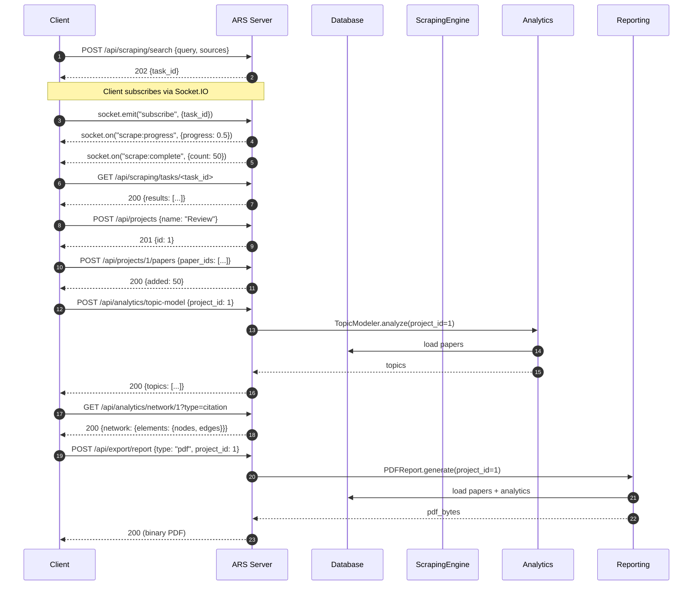
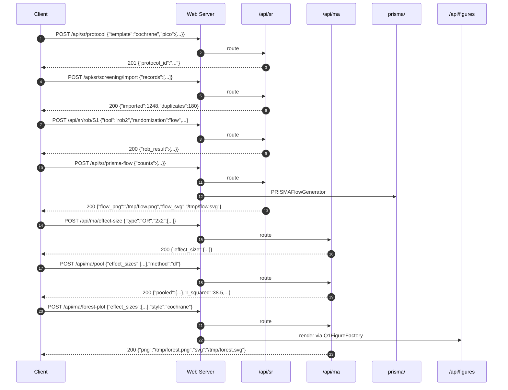

# REST API Reference

> **Base URL:** `http://127.0.0.1:8765`
> **Live docs:** <http://127.0.0.1:8765/api/docs> (when the web server is running)
> **Source:** [`web/routes/`](../web/routes/) (8 blueprints)

The Academic Research Suite web server exposes 35+ REST endpoints
across eight blueprints, plus a Socket.IO namespace for live
updates. Every endpoint speaks JSON (request body +
`application/json` response), every error returns a structured
`{"error": ..., "message": ...}` body, and every long-running
operation returns a `task_id` that you poll or subscribe to via
WebSocket.

---

## Table of Contents

1. [Conventions](#conventions)
2. [Health & Root](#health--root)
3. [`/api/papers`](#apipapers)
4. [`/api/projects`](#apiprojects)
5. [`/api/scraping`](#apiscraping)
6. [`/api/analytics`](#apianalytics)
7. [`/api/ai`](#apiai)
8. [`/api/proxy`](#apiproxy)
9. [`/api/export`](#apiexport)
10. [`/ws` (Socket.IO)](#ws-socketio)
11. [End-to-End Flow Example](#end-to-end-flow-example)
12. [Error Reference](#error-reference)

---

## Conventions

- **Content-Type** — `application/json; charset=utf-8` for request
  bodies and JSON responses. File downloads return their native
  MIME type with `Content-Disposition: attachment; filename="..."`.
- **Pagination** — list endpoints accept `page` (1-indexed) and
  `per_page` (capped at 100). The response envelope includes
  `page`, `per_page`, `total`, and `pages`.
- **Errors** — every non-2xx response has the shape:
  ```json
  {"error": "<machine_code>", "message": "<human_readable>"}
  ```
  Common codes: `bad_request` (400), `not_found` (404),
  `service_unavailable` (503), `internal_error` (500),
  `analysis_failed` (502).
- **Authentication** — none in v1.0.0 (the server binds to
  `127.0.0.1` by default). Token auth is on the
  [v1.1.0 roadmap](../README.md#roadmap).
- **CORS** — open (`*`). Tighten via `app.config["CORS_ORIGINS"]`
  in production deployments.

---

## Health & Root

### `GET /`

The browser dashboard. Returns HTML.

### `GET /api/docs`

Interactive HTML API documentation (this document rendered as a
browsable page).

### `GET /api/health`

Service health + per-module status.

```json
{
  "status": "ok",
  "version": "0.1.0",
  "python": "3.12.4",
  "platform": "linux",
  "timestamp": "2026-08-25T10:30:00+00:00",
  "modules": {
    "database": true,
    "project_manager": true,
    "scraping_engine": true,
    "proxy_pool": true,
    "chat_engine": true,
    "event_bus": true
  },
  "active_modules": ["database", "project_manager", "scraping_engine",
                     "proxy_pool", "chat_engine", "event_bus"],
  "tasks": 3
}
```

**Status codes:** `200` always (even if some modules are down —
inspect `modules` for per-subsystem health).

---

## `/api/papers`

CRUD + FTS + similar-paper lookup. Source:
[`web/routes/papers.py`](../web/routes/papers.py).

### `GET /api/papers/`

List papers with pagination and filters.

| Query param | Type | Default | Description |
|---|---|---|---|
| `source` | string | — | Filter by data source (e.g. `arxiv`). |
| `year` | int | — | Filter by publication year. |
| `q` | string | — | Free-text filter on title / abstract. |
| `project_id` | int | — | Restrict to papers in a project. |
| `page` | int | 1 | 1-indexed page number. |
| `per_page` | int | 20 | Page size, capped at 100. |

**Example:**

```bash
curl 'http://127.0.0.1:8765/api/papers/?source=arxiv&year=2023&page=1&per_page=10'
```

**Response (200):**

```json
{
  "papers": [
    {"id": 1, "title": "Attention Is All You Need", "authors": [...],
     "year": 2017, "doi": "10.48550/arXiv.1706.03762", "source": "arxiv"}
  ],
  "page": 1, "per_page": 10, "total": 1, "pages": 1
}
```

### `GET /api/papers/<int:paper_id>`

Get a single paper by ID. **200** with the paper record; **404**
if not found.

### `POST /api/papers/`

Add a paper manually.

**Request body:**

```json
{
  "title": "My Untitled Paper",
  "authors": ["Jane Doe", "John Smith"],
  "year": 2026,
  "doi": "10.1000/example",
  "abstract": "We propose ...",
  "source": "manual"
}
```

**Response (201):** the created paper with its assigned `id`.

**Errors:** `400` if `title` is missing.

### `DELETE /api/papers/<int:paper_id>`

Delete a paper by ID. **200** with `{"deleted": true, "id": <id>}`;
**404** if not found.

### `GET /api/papers/<int:paper_id>/similar`

Find papers similar to the given one via the vector store.

| Query param | Type | Default | Description |
|---|---|---|---|
| `limit` | int | 10 | Max neighbours, capped at 50. |

**Response (200):**

```json
{
  "paper_id": 42,
  "similar": [{"id": 91, "title": "...", "score": 0.87}, ...]
}
```

### `GET /api/papers/search`

Full-text search across stored papers (FTS5-backed, BM25-ranked).

| Query param | Type | Default | Description |
|---|---|---|---|
| `q` | string | required | Search query. |
| `sources` | csv | — | Comma-separated source filter. |
| `limit` | int | 25 | Max results, capped at 100. |

**Example:**

```bash
curl 'http://127.0.0.1:8765/api/papers/search?q=transformer+attention&sources=arxiv,pubmed&limit=25'
```

**Errors:** `400` if `q` is empty.

---

## `/api/projects`

CRUD for projects, plus paper-attachment, snapshots, and
side-by-side comparison. Source:
[`web/routes/projects.py`](../web/routes/projects.py).

### `GET /api/projects/`

List projects (optionally filtered by `?q=` substring).

```bash
curl 'http://127.0.0.1:8765/api/projects/?q=diffusion'
```

**Response (200):**

```json
{
  "projects": [
    {"id": 1, "name": "Diffusion Models Review",
     "description": "...", "color": "#3B82F6"}
  ],
  "count": 1
}
```

### `POST /api/projects/`

Create a project.

**Request body:**

```json
{
  "name": "My Literature Review",
  "description": "Quarterly review of GNN papers.",
  "color": "#3B82F6",
  "settings": {"auto_snapshot": true}
}
```

**Response (201):** the created project. **400** if `name` is missing.

### `GET /api/projects/<int:project_id>`

Read a single project. **404** if not found.

### `PUT /api/projects/<int:project_id>`

Update project metadata. Body is a partial dict:

```json
{"name": "Renamed Review", "color": "#10B981"}
```

**Response (200):** the updated project. **404** if not found.

### `DELETE /api/projects/<int:project_id>`

Delete a project (does NOT delete its papers).

### `POST /api/projects/<int:project_id>/papers`

Attach papers to a project.

**Request body:**

```json
{"paper_ids": [10, 11, 12]}
```

**Response (200):**

```json
{"project_id": 1, "added": 3, "paper_ids": [10, 11, 12]}
```

**Errors:** `400` if `paper_ids` is missing or empty.

### `DELETE /api/projects/<int:project_id>/papers/<int:paper_id>`

Detach a single paper from a project. **200** or **404**.

### `GET /api/projects/<int:project_id>/snapshots`

List all snapshots for a project.

### `POST /api/projects/<int:project_id>/snapshots`

Create a new snapshot.

**Request body:**

```json
{"label": "Pre-submission", "description": "Snapshot before Nature submission."}
```

**Response (201):** the snapshot record.

### `POST /api/projects/compare`

Compare two projects side-by-side.

**Request body:**

```json
{"a": 1, "b": 2}
```

**Response (200):**

```json
{
  "a": 1, "b": 2,
  "shared_papers": [...],
  "unique_to_a": [...],
  "unique_to_b": [...],
  "metrics": {"papers_delta": 5, "citations_delta": -12, "h_index_delta": 1}
}
```

---

## `/api/scraping`

Async scraping task submission with WebSocket progress streaming.
Source: [`web/routes/scraping.py`](../web/routes/scraping.py).

### `POST /api/scraping/search`

Submit a new scrape task. Returns immediately with a `task_id`;
the caller polls `/api/scraping/tasks/<id>` or subscribes via
Socket.IO for live updates.

**Request body:**

```json
{
  "query": "graph neural networks",
  "sources": ["arxiv", "pubmed"],
  "max_results": 25,
  "filters": {"year_lo": 2020, "year_hi": 2024}
}
```

**Response (202):**

```json
{"task_id": "9f3b6c1a4e8d4f3e8b2a1c5d6e7f8a9b", "status": "queued"}
```

**Errors:** `400` if `query` is empty.

### `GET /api/scraping/tasks/<task_id>`

Poll task status. Returns the full task record:

```json
{
  "task_id": "9f3b6c1a4e8d4f3e8b2a1c5d6e7f8a9b",
  "query": "graph neural networks",
  "sources": ["arxiv", "pubmed"],
  "max_results": 25,
  "filters": {},
  "status": "completed",
  "created_at": 1724582400.0,
  "started_at": 1724582400.5,
  "completed_at": 1724582405.2,
  "results_count": 50,
  "total": 50,
  "results": [...]
}
```

**Status values:** `queued`, `running`, `completed`, `failed`,
`cancelled`.

**Errors:** `404` if `task_id` is unknown.

### `GET /api/scraping/tasks`

List every known task.

### `GET /api/scraping/sources`

Return metadata for every available scraper.

```json
{
  "sources": [
    {"name": "arxiv", "display": "arXiv",
     "supports": ["search", "metadata", "fulltext"],
     "rate_limit": "1 req/s", "requires_proxy": false},
    ...
  ],
  "count": 8
}
```

### `POST /api/scraping/cancel/<task_id>`

Request cancellation of a running task. Returns the new status
(`cancelled` if successful, original status if already finished).

---

## `/api/analytics`

Wraps the `data_science` and `knowledge_graph` packages.
Source: [`web/routes/analytics.py`](../web/routes/analytics.py).

### `POST /api/analytics/topic-model`

Run topic modeling on a project's papers.

**Request body:**

```json
{"project_id": 1, "num_topics": 8, "method": "bertopic"}
```

**Response (200):**

```json
{
  "project_id": 1, "method": "bertopic", "num_topics": 8,
  "topics": [
    {"id": 0, "words": [["graph", 0.045], ["neural", 0.031], ...],
     "weight": 0.18},
    ...
  ]
}
```

**Errors:** `400` if `project_id` missing; `502` if analysis fails.

### `POST /api/analytics/cluster`

Cluster a project's papers.

**Request body:**

```json
{"project_id": 1, "method": "kmeans", "n_clusters": 5}
```

**Response (200):**

```json
{
  "project_id": 1, "method": "kmeans", "n_clusters": 5,
  "labels": {"10": 0, "11": 0, "12": 1, "13": 2, ...},
  "silhouette": 0.42
}
```

### `POST /api/analytics/temporal`

Compute a temporal time series.

**Request body:**

```json
{"project_id": 1, "metric": "publications"}
```

`metric` is one of `publications` (default), `citations`, `authors`.

**Response (200):**

```json
{
  "project_id": 1, "metric": "publications",
  "series": [{"year": 2020, "value": 12}, {"year": 2021, "value": 18}, ...]
}
```

### `GET /api/analytics/network/<int:project_id>`

Return a Cytoscape-formatted network for a project.

| Query param | Type | Default | Description |
|---|---|---|---|
| `type` | string | `citation` | One of `citation`, `collaboration`, `temporal`. |

**Response (200):**

```json
{
  "project_id": 1, "type": "citation",
  "network": {
    "elements": {
      "nodes": [{"data": {"id": "10", "label": "Attention Is All You Need"}}],
      "edges": [{"data": {"source": "10", "target": "5"}}]
    }
  }
}
```

### `GET /api/analytics/stats/<int:project_id>`

Return a bibliometric summary.

```json
{
  "project_id": 1,
  "stats": {
    "paper_count": 142, "year_range": [2018, 2024],
    "total_citations": 4521, "h_index": 28, "i10_index": 41,
    "top_authors": [...], "top_venues": [...],
    "source_breakdown": {"arxiv": 80, "pubmed": 62}
  }
}
```

---

## `/api/ai`

Streaming chat (SSE), summarization, model discovery, embeddings.
Source: [`web/routes/ai.py`](../web/routes/ai.py).

### `POST /api/ai/chat`

Stream a chat completion as Server-Sent Events. The response is
`text/event-stream`; each event is a JSON object with `{"token": str}`
for incremental output, ending with a `{"done": true}` event.

**Request body:**

```json
{
  "message": "Summarize the latest on retrieval-augmented generation.",
  "history": [{"role": "user", "content": "..."},
               {"role": "assistant", "content": "..."}],
  "use_rag": true,
  "project_id": 1
}
```

**Response (200, `text/event-stream`):**

```text
data: {"token": "Retrieval"}

data: {"token": "-augmented"}

data: {"token": " generation"}

data: {"done": true}
```

**Errors:** `400` if `message` empty. Streaming errors emit
`{"error": "internal_error", "message": "..."}` then `{"done": true}`.

### `POST /api/ai/summarize`

Summarize one or more papers.

**Request body:**

```json
{"paper_ids": [10, 11, 12], "type": "abstract"}
```

`type` is one of `abstract` (default), `key_findings`, `lay_summary`,
`bulleted`.

**Response (200):**

```json
{"paper_ids": [10, 11, 12], "type": "abstract",
 "summary": {"overview": "...", "paper_summaries": [...]}}
```

### `GET /api/ai/models`

List available LLM models.

| Query param | Type | Default | Description |
|---|---|---|---|
| `provider` | string | `all` | `openai`, `anthropic`, `ollama`, or `all`. |

**Response (200):**

```json
{
  "provider": "all",
  "models": {
    "openai": ["gpt-4o", "gpt-4o-mini", "gpt-3.5-turbo"],
    "anthropic": ["claude-3-5-sonnet", "claude-3-haiku", "claude-3-opus"],
    "ollama": ["llama3", "mistral", "phi3", "qwen2.5"]
  }
}
```

### `POST /api/ai/embeddings`

Generate embeddings for a list of texts.

**Request body:**

```json
{"texts": ["hello world", "transformer architecture"], "model": "default"}
```

**Response (200):**

```json
{"model": "default", "count": 2,
 "vectors": [[0.0123, -0.0456, ...], [0.0789, ...]]}
```

**Errors:** `400` if `texts` missing; `502` if embeddings fail.

---

## `/api/proxy`

Listing, refresh, testing, chain building, stats.
Source: [`web/routes/proxy.py`](../web/routes/proxy.py).

### `GET /api/proxy/`

List proxies with optional filters.

| Query param | Type | Default | Description |
|---|---|---|---|
| `country` | string | — | ISO country code filter. |
| `protocol` | string | — | `http`, `https`, `socks4`, `socks5`. |
| `healthy` | int | — | `1` returns only healthy proxies. |
| `page` | int | 1 | 1-indexed page number. |
| `per_page` | int | 20 | Page size, max 100. |

**Response (200):**

```json
{
  "proxies": [
    {"host": "1.2.3.4", "port": 8080, "protocol": "http",
     "country": "US", "anonymity": "elite",
     "latency_ms": 142, "success_rate": 0.95,
     "last_check": "2026-08-25T10:00:00+00:00"}
  ],
  "page": 1, "per_page": 20, "total": 187
}
```

### `POST /api/proxy/refresh`

Scrape fresh proxies and health-check the entire pool.

**Request body (optional):**

```json
{"sources": ["free_proxy_list", "spys_one"]}
```

**Response (200):**

```json
{"added": 412, "healthy": 187, "sources": ["free_proxy_list", "spys_one"]}
```

### `POST /api/proxy/test`

Test a single proxy.

**Request body:**

```json
{"host": "1.2.3.4", "port": 8080, "protocol": "http",
 "test_url": "https://httpbin.org/ip"}
```

**Response (200):**

```json
{"host": "1.2.3.4", "port": 8080, "status": "alive",
 "latency_ms": 142, "exit_ip": "1.2.3.4", "country": "US"}
```

### `POST /api/proxy/chain`

Build a proxy chain from a list of proxy IDs.

**Request body:**

```json
{"proxy_ids": [10, 11, 12]}
```

**Response (200):**

```json
{"proxy_ids": [10, 11, 12], "length": 3,
 "hops": [{"host": "...", "port": ...}, ...]}
```

### `GET /api/proxy/stats`

Pool statistics.

```json
{
  "total": 412, "healthy": 187,
  "by_country": {"US": 98, "DE": 42, ...},
  "by_protocol": {"http": 220, "socks5": 150, ...},
  "avg_latency_ms": 218.4
}
```

---

## `/api/export`

Downloadable files: tabular paper exports, full reports, BibTeX.
Source: [`web/routes/export.py`](../web/routes/export.py).

### `POST /api/export/papers`

Export papers to a downloadable file.

**Request body:**

```json
{
  "format": "csv",
  "paper_ids": [10, 11, 12],
  "columns": ["title", "authors", "year", "doi", "abstract"]
}
```

`format` is one of `csv`, `json`, `tsv`, `xlsx`.

**Response (200):** the file with `Content-Disposition:
attachment; filename="papers.csv"`.

**Errors:** `400` if format invalid or `paper_ids` empty; `404`
if no papers resolve; `501` for XLSX when `openpyxl` is missing.

### `POST /api/export/report`

Generate a full project report (PDF / DOCX / PPTX).

**Request body:**

```json
{
  "type": "pdf",
  "project_id": 1,
  "sections": ["summary", "papers", "analytics", "network"]
}
```

**Response (200):** the binary file with the appropriate MIME type
(`application/pdf`, `application/vnd.openxmlformats...wordprocessingml.document`,
or `application/vnd.openxmlformats...presentationml.presentation`).

### `POST /api/export/bibtex`

Export papers to a BibTeX file.

**Request body:**

```json
{"paper_ids": [10, 11, 12]}
```

**Response (200):** `application/x-bibtex` file with
`Content-Disposition: attachment; filename="references.bib"`.

---

## `/ws` (Socket.IO)

Live event streaming. The Socket.IO server is bound to the Flask
app at `http://127.0.0.1:8765`. When `flask-socketio` is missing
the HTTP API still works; only live updates are disabled.

### `GET /ws/status`

HTTP endpoint returning the WebSocket subsystem state:

```json
{
  "socketio_available": true,
  "event_bus_available": true,
  "tasks_tracked": 3
}
```

### Socket.IO events

| Direction | Event | Payload | Description |
|---|---|---|---|
| Client → Server | `connect` | — | Handshake; server replies with `{"status": "ok"}`. |
| Client → Server | `subscribe` | `{"task_id": "..."}` or `{"channel": "..."}` | Join a per-task or per-channel room. |
| Client → Server | `unsubscribe` | `{"task_id": "..."}` or `{"channel": "..."}` | Leave a room. |
| Server → Client | `subscribed` | `{"room": "task:..."}` | Acknowledges a subscription. |
| Server → Client | `scrape:progress` | `{"task_id": "...", "progress": 0.45, "message": "..."}` | Live progress for a scrape task. |
| Server → Client | `scrape:complete` | `{"task_id": "...", "count": 50}` | Scrape finished. |
| Server → Client | `scrape:error` | `{"task_id": "...", "error": "..."}` | Scrape failed. |
| Server → Client | `scrape:cancelled` | `{"task_id": "..."}` | Scrape was cancelled. |
| Server → Client | `log:line` | `{"level": "INFO", "name": "...", "message": "..."}` | Live log line. |
| Server → Client | `ai:token` | `{"token": "..."}` | One token of an AI chat stream. |
| Server → Client | `ai:done` | `{"task_id": "..."}` | AI chat finished. |

**JavaScript example:**

```javascript
const socket = io("http://127.0.0.1:8765");

socket.on("connect", () => {
  socket.emit("subscribe", {task_id: TASK_ID});
});

socket.on("scrape:progress", (data) => {
  console.log(`[${data.progress * 100}%] ${data.message}`);
});

socket.on("scrape:complete", (data) => {
  console.log(`Done — ${data.count} papers`);
});
```

---

## End-to-End Flow Example

The canonical "scrape → analyze → report" flow over the REST API:



**One-shot bash version:**

```bash
# 1. Submit a scrape
TASK=$(curl -sX POST http://127.0.0.1:8765/api/scraping/search \
  -H 'Content-Type: application/json' \
  -d '{"query":"diffusion models","sources":["arxiv"],"max_results":50}' \
  | jq -r .task_id)

# 2. Poll until completed
while :; do
  STATUS=$(curl -s http://127.0.0.1:8765/api/scraping/tasks/$TASK | jq -r .status)
  [ "$STATUS" = "completed" ] && break
  sleep 1
done

# 3. Create a project
PID=$(curl -sX POST http://127.0.0.1:8765/api/projects/ \
  -H 'Content-Type: application/json' \
  -d '{"name":"Diffusion Review"}' | jq -r .id)

# 4. Attach the scraped papers
PAPERS=$(curl -s http://127.0.0.1:8765/api/scraping/tasks/$TASK \
  | jq '[.results[].id]')
curl -sX POST http://127.0.0.1:8765/api/projects/$PID/papers \
  -H 'Content-Type: application/json' \
  -d "{\"paper_ids\": $PAPERS}"

# 5. Run topic modeling
curl -sX POST http://127.0.0.1:8765/api/analytics/topic-model \
  -H 'Content-Type: application/json' \
  -d "{\"project_id\": $PID, \"num_topics\": 8}" | jq .

# 6. Generate the PDF report
curl -sX POST http://127.0.0.1:8765/api/export/report \
  -H 'Content-Type: application/json' \
  -d "{\"type\":\"pdf\",\"project_id\":$PID}" \
  -o diffusion_review.pdf
```

---

## Error Reference

Every error response follows this shape:

```json
{"error": "<code>", "message": "<human readable>"}
```

| Code | HTTP | Meaning |
|---|---|---|
| `bad_request` | 400 | Missing or invalid request body / params. |
| `not_found` | 404 | Resource (paper, project, task, snapshot) not found. |
| `service_unavailable` | 503 | Backend module not initialized. Check `/api/health`. |
| `internal_error` | 500 | Unhandled server error; check `logs/ars.log`. |
| `analysis_failed` | 502 | Analytics / network / stats call raised. |
| `not_implemented` | 501 | Endpoint exists but the underlying feature is missing (e.g. XLSX export without `openpyxl`). |

---

*The live docs at <http://127.0.0.1:8765/api/docs> always reflect
the exact version of the server you're running — prefer them when
this Markdown falls out of date.*

---

## v2.0.0 Endpoints

ARS v2.0.0 adds **seven new Flask blueprints** totalling **47 new REST
endpoints** on top of the v1.0.0 baseline. All endpoints follow the
v1 conventions — JSON in / JSON out, structured `{"error", "message"}`
on failure, `service_unavailable` (503) when the backend module is not
initialised, `analysis_failed` (502) when a backend call raises. Each
endpoint is documented below with its method, path, request schema,
response schema, an example, and the status codes it can return.



---

### `/api/bibliometrics` — 6 endpoints

Wraps the v2.0.0 `bibliometrics/` package (Publish-or-Perish indices,
JCR-style journal metrics, VOSviewer networks, CiteSpace burst detection).

#### `POST /api/bibliometrics/indices`
Compute all Publish-or-Perish indices from citation and year vectors.

- **Request body:** `{"citations": [int, ...], "years"?: [int, ...]}`
- **Response 200:** `{"indices": {"h_index": 12, "e_index": 9.3, "g_index": 15, "i10_index": 8, "contemporary_h_index": 8.7, ...}}`
- **Errors:** `bad_request` (400) for non-int lists, `analysis_failed` (502) for backend exceptions.

Example:
```bash
curl -sX POST http://127.0.0.1:8765/api/bibliometrics/indices \
  -H 'Content-Type: application/json' \
  -d '{"citations":[15,12,8,7,5,3,2,1,1,0]}' | jq .
```

#### `POST /api/bibliometrics/journal-metrics`
Compute impact factor, 5-year IF, immediacy, eigenfactor, SJR, SNIP,
citeScore, h5-index/median, quartile.

- **Request body:** `{"papers": [...], "journal": "Nature", "year": 2024}`
- **Response 200:** `{"metrics": {"impact_factor": 42.7, "five_year_if": 41.4, ...}}`

#### `POST /api/bibliometrics/vos`
Run a VOSviewer-style co-citation / co-authorship / bibliographic-coupling analysis.

- **Request body:** `{"papers": [...], "analysis": "co_citation", "min_shared": 1}`
- **Response 200:** `{"graph": <node-link JSON>, "clusters": {...}}`

#### `POST /api/bibliometrics/bursts`
Detect citation bursts via CiteSpaceAnalyzer.

- **Request body:** `{"papers": [...], "time_window": 1, "s": 2.0, "gamma": 1.0}`
- **Response 200:** `{"bursts": [{"entity_id": "...", "start_year": 2018, "end_year": 2022, "strength": 8.4, ...}]}`

#### `GET /api/bibliometrics/author-profile/<author_id>`
Return the `AuthorProfile` for the given author (citations sorted,
h-index, e-index, g-index, h-core, etc.).

- **Path param:** `author_id` (URL-encoded author name or ORCID iD).
- **Response 200:** `{"profile": {"h_index": 24, "e_index": 32.1, "total_citations": 1842, ...}}`
- **Errors:** `not_found` (404) when no papers by this author exist.

#### `GET /api/bibliometrics/journal-profile/<path:journal_name>`
Return the `JournalProfile` for the given journal.

- **Path param:** `journal_name` (URL-encoded; supports slashes).
- **Response 200:** `{"profile": {"impact_factor": 42.7, "quartile": "Q1", ...}}`

---

### `/api/network` — 9 endpoints

Wraps `networkx_pro/` and `gephi_viz/` for graph algorithms + visual analytics.

| Method | Path | Body | Response |
|---|---|---|---|
| POST | `/api/network/centrality` | `{"graph": <node-link>, "algorithm": "pagerank"\|"hits"\|"betweenness"\|...}` | `{"centralities": {node: score, ...}}` |
| POST | `/api/network/community` | `{"graph": ..., "method": "louvain"\|"label_propagation"\|"modularity"}` | `{"communities": {node: community_id, ...}, "n_communities": 4}` |
| POST | `/api/network/components` | `{"graph": ..., "type": "weak"\|"strong"\|"biconnected"}` | `{"components": [[nodes], ...], "n_components": 7}` |
| POST | `/api/network/paths` | `{"graph": ..., "source": "A", "target": "B", "weight": "weight"}` | `{"shortest_path": ["A", "C", "B"], "length": 2.4, "all_pairs": [...]}` |
| POST | `/api/network/link-prediction` | `{"graph": ..., "method": "jaccard"\|"adamic_adar"\|"preferential_attachment"\|"resource_allocation"}` | `{"predictions": [{"u": "A", "v": "B", "score": 0.42}, ...]}` |
| POST | `/api/network/layouts` | `{"graph": ..., "layout": "forceatlas2"\|"openord"\|"yifanhu"\|"spring"\|"circular"\|"kamada_kawai", "iterations": 200}` | `{"positions": {node: [x, y], ...}}` |
| POST | `/api/network/stats` | `{"graph": ...}` | `{"n_nodes": 34, "n_edges": 78, "density": 0.139, "avg_clustering": 0.58, "diameter": 5, "n_components": 1, ...}` (34 metrics via `NetworkStatistics.compute_all`) |
| POST | `/api/network/filter` | `{"graph": ..., "filters": [{"type": "degree", "min": 3}, {"type": "k_core", "k": 2}]}` | `{"filtered_graph": <node-link>, "n_nodes_remaining": 12, "n_edges_remaining": 24}` |
| POST | `/api/network/export` | `{"graph": ..., "format": "gexf"\|"graphml"\|"json"\|"pajek"}` | File download (200, `Content-Disposition: attachment`) |

Status codes: `bad_request` (400), `not_found` (404), `service_unavailable` (503), `analysis_failed` (502).

---

### `/api/sr` — 11 endpoints

Wraps `systematic_review/` for the full SR workflow.

| Method | Path | Body / Params | Response |
|---|---|---|---|
| POST | `/api/sr/protocol` | `{"template": "cochrane"\|"campbell"\|"jbi"\|"prisma_2020", "pico": {...}, "authors": [...]}` | `201 {"protocol_id": "...", "protocol": {...}}` |
| GET | `/api/sr/protocol/<protocol_id>` | — | `{"protocol": {...}}` or `not_found` (404) |
| PUT | `/api/sr/protocol/<protocol_id>` | `{"updates": {...}}` | `{"protocol": {...}}` |
| POST | `/api/sr/screening/import` | `{"records": [...], "stage": "title_abstract"}` | `{"imported": 1248, "duplicates_removed": 180}` |
| POST | `/api/sr/screening/<record_id>/decide` | `{"decision": "include"\|"exclude"\|"maybe", "reviewer": "Alice", "exclusion_reason": "wrong_population", "stage": "title_abstract"\|"full_text"}` | `{"record": {...}}` |
| GET | `/api/sr/screening/progress` | — | `{"title_abstract": {"included": 200, "excluded": 800, "pending": 200}, "full_text": {...}, "kappa": 0.78}` |
| POST | `/api/sr/rob/<study_id>` | `{"tool": "rob2"\|"robins_i"\|"quadas2"\|"nos", "study_data": {...}}` | `{"rob_result": {"overall": "low"\|"some_concerns"\|"high", "domains": {...}, "summary_figure": "/tmp/rob.png"}}` |
| GET | `/api/sr/rob/<study_id>` | — | `{"rob_result": {...}}` |
| POST | `/api/sr/extraction/<study_id>` | `{"form": {"population": ..., "intervention": ..., "outcomes": [...]}}` | `{"form": {...}}` |
| POST | `/api/sr/synthesis` | `{"method": "narrative"\|"thematic"\|"qca"\|"meta_analysis", "extractions": [...]}` | `{"synthesis_result": {...}}` |
| POST | `/api/sr/prisma-flow` | `{"counts": <PRISMAStageCounts dict>, "title": "...", "extension": "standard"\|"ipd"\|"nma"\|"scr"\|"harms"\|"abstract"\|"diagnostic", "style": "bmj"\|"jama"\|"lancet", "format": "png"\|"svg"\|"pdf"\|"html"}` | `{"outputs": {"png": "/tmp/flow.png", "svg": "/tmp/flow.svg", "pdf": "/tmp/flow.pdf"}}` |
| GET | `/api/sr/prisma-checklist` | — | `{"items": [{"id": 1, "section": "Title", "item_text": "...", "reported": false, ...}, ...]}` (27 items) |

---

### `/api/ma` — 8 endpoints

Wraps `meta_analysis/` for effect-size computation, pooling, forest /
funnel plots, subgroup / sensitivity analyses, network meta-analysis,
and report generation.

| Method | Path | Body | Response |
|---|---|---|---|
| POST | `/api/ma/effect-size` | `{"type": "MD"\|"SMD"\|"RR"\|"OR"\|"HR"\|"RD", "2x2": [a, b, c, d]?, "continuous": {g1, g2}?, "smd_method": "cohen"\|"hedges"\|"glass"?}` | `{"effect_size": {type, value, se, ci_lower, ci_upper, ...}}` |
| POST | `/api/ma/pool` | `{"effect_sizes": [...], "method": "fixed"\|"iv"\|"mh"\|"peto"\|"dl"\|"reml"\|"ml"\|"eb", "confidence": 0.95}` | `{"pooled": {...}, "weights": [...], "I_squared": 38.5, "tau_squared": 0.018, "Q_statistic": 19.5, "Q_p_value": 0.144, "test_statistic": 3.91, "p_value": 9.2e-5, "method": "dl"}` |
| POST | `/api/ma/forest-plot` | `{"effect_sizes": [...], "pooled"?: ..., "style": "cochrane"\|"jama"\|"lancet", "x_scale": "natural"\|"log", "study_names"?: [...], "weights"?: [...]}` | `{"png": "/tmp/forest.png", "svg": "/tmp/forest.svg"}` |
| POST | `/api/ma/funnel-plot` | `{"effect_sizes": [...], "pooled"?: ..., "style": "cochrane", "contour_enhanced": true, "trim_fill": true}` | `{"png": "/tmp/funnel.png", "svg": "/tmp/funnel.svg", "eggers_test": [t, p, intercept], "beggs_test": [tau, p], "trim_fill_added": 2}` |
| POST | `/api/ma/subgroup` | `{"effect_sizes": [...], "subgroups": {study_id: name, ...}, "method": "dl"}` | `{"subgroup_effects": {name: {pooled, ci, ...}}, "Q_between": ..., "Q_within": {...}, "p_value": ..., "I_squared_within": {...}}` |
| POST | `/api/ma/sensitivity` | `{"effect_sizes": [...], "method": "leave_one_out"\|"cumulative"\|"influence", "order_by"?: "year", "pooling_method": "dl"}` | `{"results": [{pooled, ci_lower, ci_upper, p_value, ...}, ...]}` |
| POST | `/api/ma/nma` | `{"comparisons": [{study_id, treatment_a, treatment_b, effect_size, se, n_total}], "model": "consistency"\|"inconsistency"}` | `{"relative_effects": <DataFrame>, "ranking": {treatment: [P(rank=k)]}, "sucra": {treatment: 0.85}, "inconsistency_Q": ..., "AIC": ..., "BIC": ...}` |
| POST | `/api/ma/report` | `{"pooled_result": {...}, "forest_plot"?: "/tmp/forest.png", "funnel_plot"?: "/tmp/funnel.svg", "format": "pdf"\|"docx"\|"markdown"}` | File download |

---

### `/api/figures` — 16 endpoints

Wraps `q1_figures/` for journal-specific figure generation.

| Method | Path | Body | Response |
|---|---|---|---|
| POST | `/api/figures/forest` | `{"effect_sizes": [...], "journal": "nature"\|"science"\|"cell"\|"nejm"\|"lancet"\|"jama", "style": "cochrane", "figsize"?: [w, h], "dpi"?: 300}` | `{"png": "/tmp/forest.png", "svg": "/tmp/forest.svg"}` |
| POST | `/api/figures/funnel` | (similar to forest) | `{"png": ..., "svg": ...}` |
| POST | `/api/figures/volcano` | `{"log2fc": [...], "neg_log10_p": [...], "gene_names"?: [...], "fc_threshold": 1.0, "p_threshold": 0.05, "palette": "nature", "highlight_top_n": 10}` | `{"png": ..., "svg": ...}` |
| POST | `/api/figures/manhattan` | `{"chrom": [...], "pos": [...], "p_value": [...], "threshold": 5e-8, "palette": "grayscale"}` | `{"png": ..., "svg": ...}` |
| POST | `/api/figures/qq` | `{"observed_p": [...], "ci": 0.95}` | `{"png": ..., "svg": ...}` |
| POST | `/api/figures/kaplan-meier` | `{"time": [...], "event": [...], "groups"?: [...], "palette": "nature", "show_ci": true, "show_at_risk_table": true}` | `{"png": ..., "svg": ...}` |
| POST | `/api/figures/roc` | `{"fpr": [...], "tpr": [...], "auc"?: 0.84, "ci"?: [0.79, 0.89], "palette": "nature"}` | `{"png": ..., "svg": ...}` |
| POST | `/api/figures/pr-curve` | `{"precision": [...], "recall": [...], "ap"?: 0.76, "palette": "nature"}` | `{"png": ..., "svg": ...}` |
| POST | `/api/figures/boxplot` | `{"data": [[...], ...], "groups": [...], "palette": "nature", "show_points": true, "notch": true}` | `{"png": ..., "svg": ...}` |
| POST | `/api/figures/violin` | `{"data": [[...], ...], "groups": [...], "palette": "nature", "show_box": true}` | `{"png": ..., "svg": ...}` |
| POST | `/api/figures/raincloud` | `{"data": [[...], ...], "groups": [...], "palette": "nature", "orientation": "horizontal"}` | `{"png": ..., "svg": ...}` |
| POST | `/api/figures/heatmap` | `{"matrix": [[...], ...], "labels"?: [...], "palette": "viridis"}` | `{"png": ..., "svg": ...}` |
| POST | `/api/figures/network` | `{"graph": <node-link>, "layout": "spring"\|"fa2", "partition"?: {...}, "ranking"?: {...}, "palette": "nature"}` | `{"png": ..., "svg": ...}` |
| POST | `/api/figures/sankey` | `{"flows": [[source, target, value], ...], "palette": "nature"}` | `{"png": ..., "svg": ...}` |
| POST | `/api/figures/multi-panel` | `{"rows": 2, "cols": 2, "panels": [{"type": "forest", ...}, ...], "panel_labels": "abcd", "journal": "nature"}` | `{"png": ..., "svg": ...}` |
| GET | `/api/figures/palettes` | — | `{"palettes": ["nature", "science", "cell", "nejm", "lancet", "jama", "colorblind_safe", ...]}` |

All POST endpoints accept an optional `"dpi"` field (default 300, max
600) and `"figsize"` field (e.g. `[3.5, 2.5]`). The response always
contains both `png` and `svg` file paths under the system temp dir —
download via `GET /api/files/<filename>` (added in v2.0.0).

---

### `/api/innovation` — 7 endpoints

Wraps `innovation/` for burst detection, frontier mapping, forecasting,
recommendations, novelty scoring, and research-direction recommendations.

| Method | Path | Body | Response |
|---|---|---|---|
| POST | `/api/innovation/bursts` | `{"papers": [...], "entity_type": "paper"\|"author"\|"keyword"\|"journal"\|"topic", "time_window": 1, "threshold": 2.0}` | `{"bursts": [{entity_id, entity_name, entity_type, start_year, end_year, peak_year, strength, duration, total_burst_score}, ...]}` |
| POST | `/api/innovation/frontiers` | `{"papers": [...], "method": "embedding_density"\|"topic_model_boundary"\|"citation_velocity", "top_n": 10}` | `{"frontiers": [{id, novelty_score, growth_rate, keywords, representative_papers: [...], ...}, ...]}` |
| POST | `/api/innovation/forecast` | `{"papers": [...], "target": "field"\|"topic"\|"author"\|"paper", "field_of_study"?: "...", "topic"?: "...", "author_id"?: "...", "paper_id"?: "...", "years_ahead": 5, "method": "arima"\|"prophet"\|"linear"\|"exponential"}` | `{"forecast": {historical_values: [...], forecast_values: [...], ci_lower: [...], ci_upper: [...], model_name: "ARIMA(1,1,1)", method: "arima"}}` |
| POST | `/api/innovation/recommend-papers` | `{"papers": [...], "mode": "similar"\|"query"\|"topic"\|"user"\|"bridge"\|"trending", "seed_paper"?: ..., "query"?: "...", "topic"?: "...", "user_history"?: [...], "paper_a"?: ..., "paper_b"?: ..., "top_k": 10}` | `{"recommendations": [{paper: {...}, score: 0.84, explanation: "..."}, ...]}` |
| POST | `/api/innovation/recommend-collaborators` | `{"papers": [...], "author": "Alice Smith", "top_k": 10, "exclude_existing": true}` | `{"collaborators": [{name, score, complementary_expertise, weak_ties_score}, ...]}` |
| POST | `/api/innovation/novelty` | `{"papers": [...], "paper_id": "10.1234/xxx", "include_disruption": true, "include_atypicality": true}` | `{"novelty_score": {paper_id, novelty_score, atypicality_score, disruption_index, percentile, closest_neighbors: [...]}}` |
| POST | `/api/innovation/directions` | `{"papers": [...], "topic"?: "...", "count": 5, "gaps"?: [...], "frontiers"?: [...], "trends"?: [...]}` | `{"directions": [{title, description, motivation, expected_impact, novelty_score, feasibility_score, supporting_papers, keywords, estimated_duration_months, suggested_collaborators}, ...]}` |

---

### `/api/lifecycle` — 8 endpoints

Wraps `research_lifecycle/` for ideation, protocol templates, quality
assessment, reporting checklists, and the AI writing assistant.

| Method | Path | Body / Params | Response |
|---|---|---|---|
| POST | `/api/lifecycle/gaps` | `{"papers": [...], "n": 10}` | `{"gaps": [{title, description, evidence_papers, novelty_score}, ...]}` |
| POST | `/api/lifecycle/ideas` | `{"topic": "...", "n": 5, "papers"?: [...]}` | `{"ideas": [{title, hypothesis, methodology, expected_impact}, ...]}` |
| GET | `/api/lifecycle/protocol-templates` | — | `{"templates": [{"name": "cochrane", "sections": [...]}, {"name": "campbell", ...}, ...]}` (≥9 templates) |
| POST | `/api/lifecycle/protocol` | `{"template": "cochrane", "pico": {...}, "eligibility": {...}, "search_strategy": {...}, "authors"?: [...]}` | `201 {"protocol_id": "...", "protocol": {...}}` |
| GET | `/api/lifecycle/extraction-templates` | — | `{"templates": [{"name": "default", "fields": [...]}, ...]}` |
| POST | `/api/lifecycle/quality-assessment` | `{"tool": "strobe"\|"consort"\|"prisma_compliance"\|"casp"\|"mmat"\|"entreq"\|"care"\|"care_plus"\|"srqr", "study_data": {...}}` | `{"quality_result": {"tool": "consort", "items": [...], "overall_score": 0.85}}` |
| GET | `/api/lifecycle/reporting-checklists` | — | `{"checklists": [{"name": "consort", "items": [...]}, {"name": "strobe", ...}, ...]}` (10 EQUATOR checklists) |
| POST | `/api/lifecycle/write` | `{"section": "abstract"\|"introduction"\|"methods"\|"results"\|"discussion", "outline"?: "...", "supporting_papers"?: [...], "word_count"?: 500, "style": "apa"\|"nature"\|"vancouver"}` | `{"text": "...", "citations": [...], "bibliography": "..."}` |

---

### Status codes summary

| Code | Meaning | When |
|---|---|---|
| 200 OK | Success | Default for all GETs and successful POSTs |
| 201 Created | Success (new resource) | POST that creates a protocol / project |
| 400 `bad_request` | Invalid JSON or schema | Missing required field, wrong type |
| 404 `not_found` | Resource not found | Unknown ID, unknown author |
| 502 `analysis_failed` | Backend raised | Numerical error, missing data |
| 503 `service_unavailable` | Backend not initialised | Module import failed on startup |
| 501 `not_implemented` | Endpoint exists but feature missing | Optional dependency not installed |

---

*For the v1.0.0 endpoints (papers / projects / scraping / analytics /
ai / proxy / export / ws), see the sections above. For usage examples
of the underlying Python classes wrapped by these endpoints, see
[PRISMA_GUIDE.md](PRISMA_GUIDE.md), [META_ANALYSIS_GUIDE.md](META_ANALYSIS_GUIDE.md),
[Q1_FIGURES_GUIDE.md](Q1_FIGURES_GUIDE.md), and
[INNOVATION_GUIDE.md](INNOVATION_GUIDE.md).*
