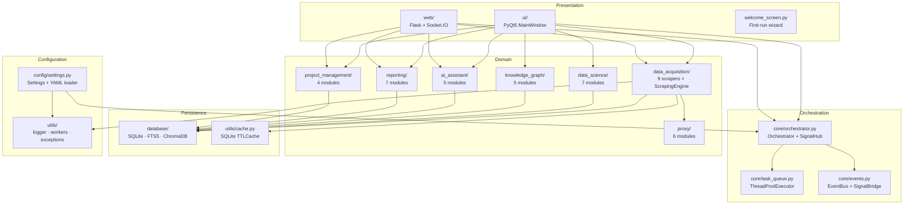
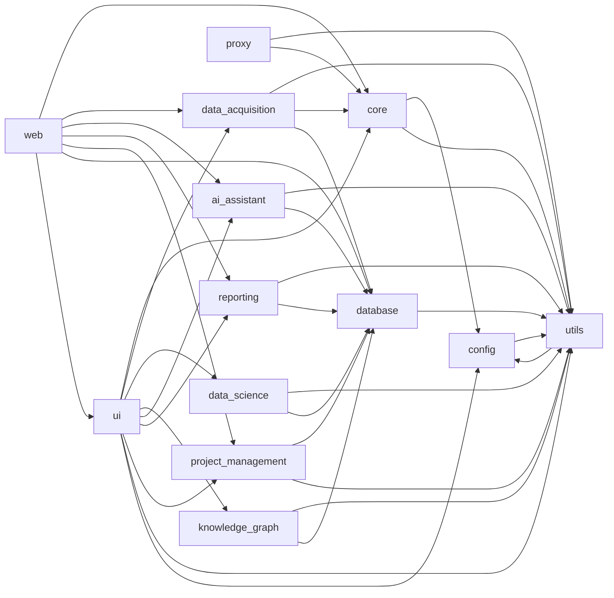
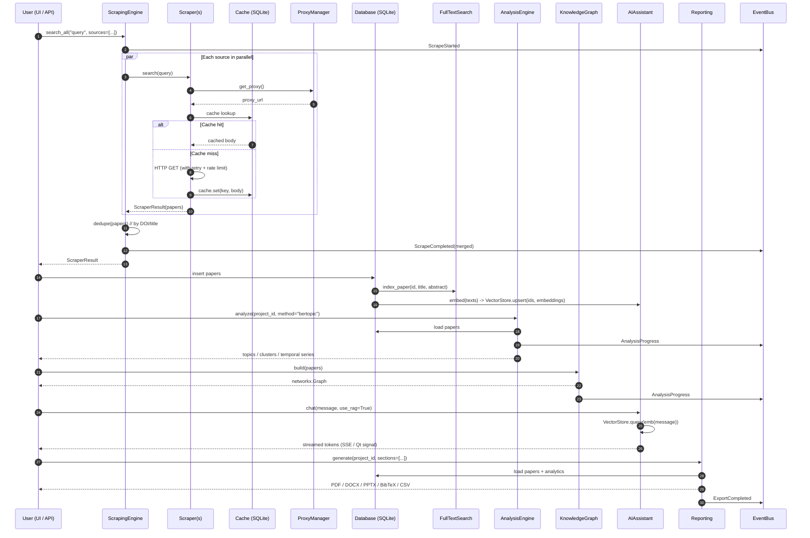
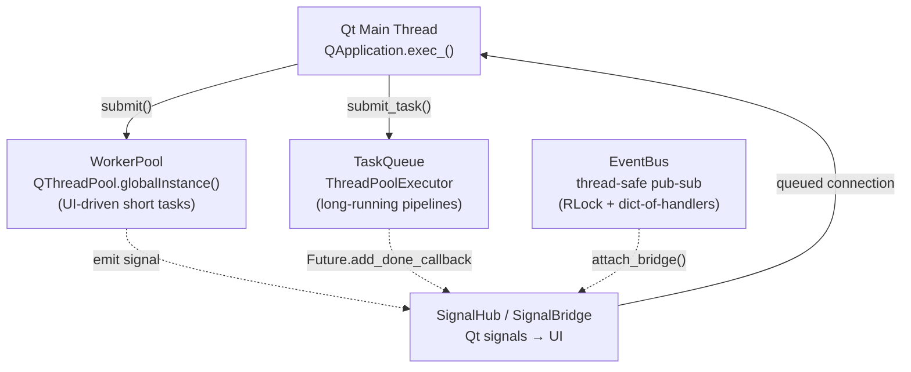
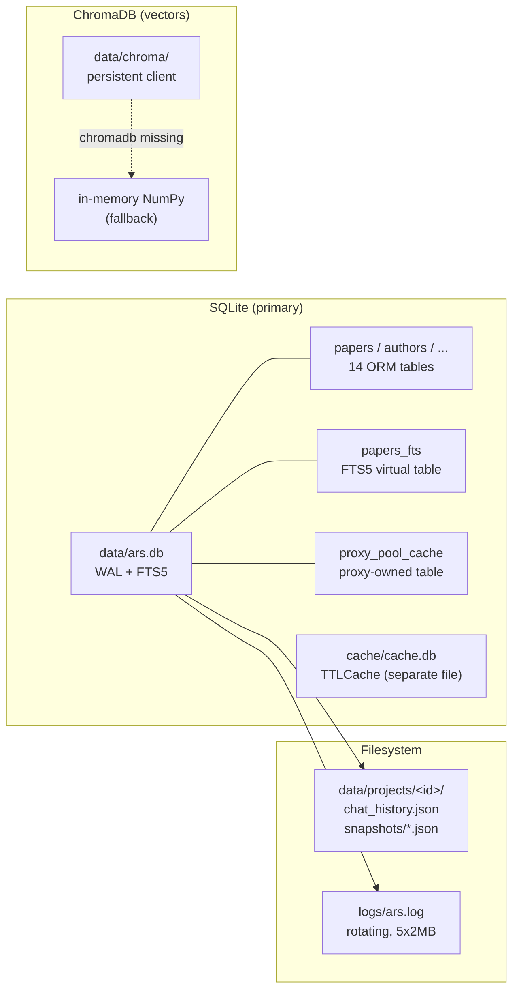
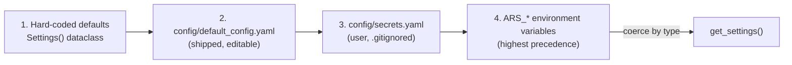
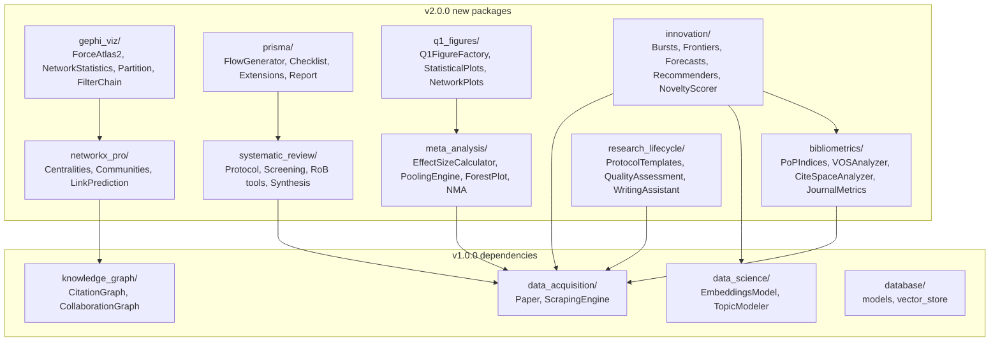
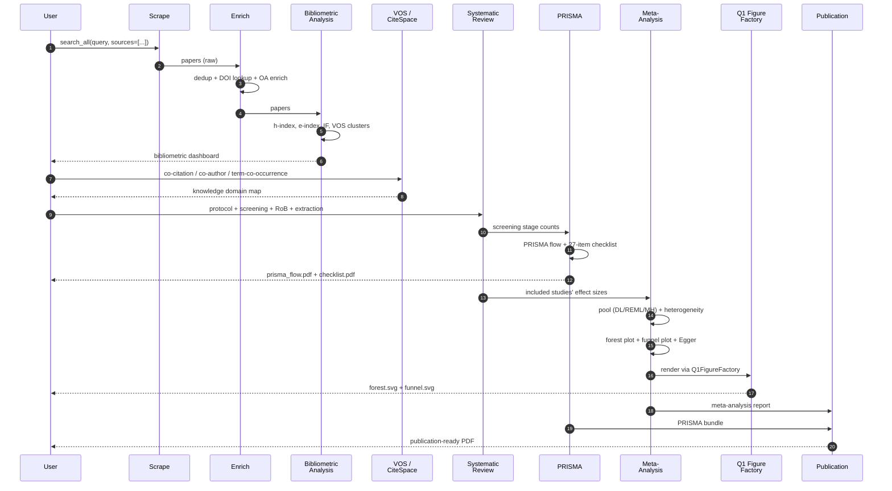

# System Architecture

> **Audience:** maintainers, contributors, integrators.
> **Companion docs:** [user_guide.md](user_guide.md) (end-user),
> [development.md](development.md) (developer),
> [api_reference.md](api_reference.md) (REST reference).

This document describes how Academic Research Suite (ARS) is put
together: the design goals that drove the architecture, the module
dependency graph, the threading and persistence models, and the
extension points that let you grow the suite without forking it.

---

## 1. Overview

Academic Research Suite is a **single-binary, offline-first desktop
workbench** for academic literature research. It bundles nine
domain packages behind a PyQt5 desktop UI and an optional local
Flask web server. The system is built around five design goals:

1. **Modularity** — every package is independently importable
   (`python -c "import <pkg>"` must never raise). Heavy / optional
   dependencies are imported lazily inside the functions that need
   them.
2. **Extensibility** — adding a new scraper, analysis, report
   format, or AI provider should not require touching unrelated
   modules. Each subsystem has a documented extension point.
3. **Offline-first** — the entire suite runs without network or
   API keys via the offline echo LLM backend and the in-memory NumPy
   vector store. Real services slot in when available.
4. **Real scrapers only** — no mock data. The database starts empty
   and is populated exclusively by real HTTP calls (or by manual
   insertion via the UI / REST API).
5. **MIT License** — every file carries the standard header; the
   project ships under a single license with no viral components.

ARS is **not** a SaaS. It is a local workbench that the researcher
fully owns — the SQLite database, the ChromaDB vector store, the
proxy pool, and every cache file live under `data/` and travel with
the user.

---

## 2. High-Level Architecture Diagram



The **Orchestrator** is the canonical entry point for cross-cutting
workflows (`scrape → clean → analyze → visualize → report`). It
holds references to registered modules, accepts `submit_task(name,
fn, *args, stage=, **kwargs)` calls, and dispatches onto the shared
`TaskQueue`. UI widgets and web routes also talk to the domain
packages directly when the Orchestrator is overkill.

---

## 3. Module Dependency Graph

The directed graph below shows compile-time (import-time)
dependencies only — runtime calls (e.g. `ScrapingEngine` talking to
the `EventBus` via lazy imports) are omitted for clarity.



The graph is intentionally a **DAG**: no import cycles exist between
top-level packages, and within a package the lazy-import discipline
keeps module-level imports light (any heavy or optional third-party
import lives inside a function body, never at module scope).

---

## 4. Component Descriptions

### `config/`

Configuration management. Holds the canonical `Settings` dataclass
with 17 typed fields and the layered loader: hard-coded defaults →
`default_config.yaml` → `secrets.yaml` → `ARS_`-prefixed env vars.
The singleton is accessed via `get_settings(refresh=False)`. See
[Configuration Reference in the README](../README.md#configuration-reference)
for the full table.

### `core/`

Process-wide orchestration primitives:

- **`events.py`** — `EventType` enum (9 canonical types), `Event`
  dataclass, thread-safe `EventBus` with wildcard subscriptions, and
  `SignalBridge(QObject)` so any Qt slot can subscribe in one call.
- **`task_queue.py`** — `Task`/`TaskStatus` dataclasses plus
  `TaskQueue`, a `ThreadPoolExecutor` wrapper with `enqueue`,
  `wait_all`, `cancel`, `list_by_status`, and `results`.
- **`orchestrator.py`** — `SignalHub` (composition around an internal
  `QObject`, avoiding sip-singleton issues) emitting `task_started`,
  `task_progress`, `task_completed`, `task_failed`, `stage_changed`.
  `Orchestrator` exposes `register_module`, `submit_task(stage=...)`,
  `get_status`, `cancel`, `wait_all`, `shutdown`. Singleton via
  `get_orchestrator()`.

### `utils/`

Shared infrastructure:

- **`logger.py`** — `get_logger(name)` returning a logger with a
  rotating `FileHandler` (`logs/ars.log`, 2 MB, 5 backups) + console
  `StreamHandler`. Exact format:
  `%(asctime)s [%(levelname)s] %(name)s: %(message)s`. Also
  `QtLogHandler` (re-emits records as a Qt signal) and `LogViewer`
  (10 000-line ring-buffer `QPlainTextEdit`).
- **`workers.py`** — `WorkerSignals(QObject)`, `Worker(QRunnable)`,
  `WorkerPool` (composition around `QThreadPool.globalInstance()`),
  and the convenience helper `run_in_background(func, *args, on_done=,
  on_progress=, on_error=, on_started=, on_finished=, **kwargs)`.
- **`cache.py`** — SQLite-backed `Cache` (`data/cache/cache.db`,
  WAL mode, `RLock`-guarded) with `get`, `set(key, value, ttl, tag)`,
  `invalidate`, `clear(tag)`, `keys(tag)`. `TTLCache(Cache)` adds
  automatic expiry on `get()` and `purge_expired()`.
- **`config_manager.py`** — `ConfigManager(QObject)` wrapping the
  `Settings` singleton. Emits `config_changed(key, value)` on every
  `set()`. `to_dict()` / `from_dict(d, persist=False)` /
  `save(path=None)` (writes `secrets.yaml`).
- **`exceptions.py`** — `ARSError` base + 9 subclasses
  (`ScraperError`, `ProxyError`, `ProxyChainError`,
  `ProxyRotationError`, `DatabaseError`, `AIError`, `ExportError`,
  `ConfigError`, `AnalysisError`). Every error carries `cause` and
  `details` and exposes `to_dict()` for UI display.

### `data_acquisition/`

Eleven modules. `base_scraper.py` defines the contract:

- `Paper` dataclass — title, authors, abstract, DOI, year, citation
  count, references, keywords, identifiers, source, raw payload.
- `ScraperResult` dataclass — source, query, papers, total_results,
  raw_response, timestamp, elapsed_ms, errors[].
- `BaseScraper(ABC)` — abstract `search(query, **kwargs)` and
  `fetch_by_id(paper_id)`; concrete `_make_request()` with
  `tenacity` retries, exponential back-off, 429/5xx retry policy,
  per-instance token-bucket rate limiter (`_TokenBucket`), optional
  `ProxyManager` injection, optional `Cache` integration, lazy
  `EventBus` event emission.

The eight concrete scrapers (`arxiv_scraper.py`,
`pubmed_scraper.py`, `openalex_scraper.py`,
`semantic_scholar_scraper.py`, `crossref_scraper.py`,
`dblp_scraper.py`, `google_scholar_scraper.py`, `orcid_scraper.py`)
plus `doi_lookup.py` round out the package.
`scraping_engine.py` provides the multi-source `ScrapingEngine`
facade with `search_all()`, `search_advanced()` (filter translation),
`export_results()`, and `search_all_async(callback=)`.

### `proxy/`

Six-module proxy suite:

- **`proxy_manager.py`** — `Proxy` dataclass + `ProxyManager(QObject)`
  with 4 Qt signals and SQLite persistence (own table
  `proxy_pool_cache`, isolated from the database package).
- **`proxy_scraper.py`** — 9 free-proxy sources catalogued in
  `DEFAULT_SOURCES` with four parser types (`raw_iport`,
  `proxylistdownload`, `html_table`, `spys_one`). Parallel
  `scrape_all_sources()` with dedup by `protocol://host:port`.
- **`proxy_health_check.py`** — `ProxyCheckResult` dataclass,
  `ProxyHealthChecker.check_proxy(p, test_url, timeout)`,
  `check_batch(proxies, max_workers=50)`, `continuous_monitor()`
  daemon thread, `geoip_lookup(ip)` with 6-hour TTL cache.
- **`proxy_chain.py`** — `ProxyChain` with hand-rolled SOCKS4/5 and
  HTTP-CONNECT protocol handshakes; `send_request()` returns a real
  `requests.Response`. TLS via `ssl.create_default_context`.
- **`proxy_rotation.py`** — `RotationStrategy` enum
  (`ROUND_ROBIN`, `RANDOM`, `LEAST_USED`, `BEST_LATENCY`,
  `WEIGHTED_BY_SUCCESS`) + `ProxyRotator` with banlist / cooldown
  and `on_rotate(old, new)` callback.
- **`proxy_pool.py`** — `ProxyPool` facade wiring the above
  together. `refresh_pool(target_count=200, max_workers=,
  progress_cb=)`, `get_workable()`, `get_proxy(strategy=None)`,
  `start_background_refresh(interval_min=30)`,
  `export_to_file(path, fmt)`, `import_from_file(path)`.

### `data_science/`

Seven modules: `analysis_engine.py` (load/save/summary/clean +
EventBus integration), `topic_modeler.py` (LDA/NMF/BERTopic +
`TopicModel` dataclass), `embeddings.py` (sentence-transformers
wrapper with deterministic SHA-256-hash fallback),
`clustering.py` (KMeans/DBSCAN/HDBSCAN/Agglomerative +
`optimal_k`), `temporal_analysis.py` (publication/citation series,
topic_evolution, ARIMA forecast with linear fallback),
`statistics.py` (`Bibliometrics` with h/i10/g indices,
co-citation / co-authorship matrices), `visualizations.py`
(`Visualizer` with 8 figure-returning methods and CJK font
fallback). PEP 562 `__getattr__` keeps the package import light.

### `knowledge_graph/`

Five modules: `network_analyzer.py` (unified `NetworkAnalyzer`),
`citation_graph.py` (`CitationGraph` with PageRank + HITS,
h-index per node), `collaboration_graph.py` (co-authorship
projection), `temporal_network.py` (year-tagged `TemporalNetwork`
with `visualize_evolution()` GIF output), `graph_algorithms.py`
(`GraphAlgorithms` — k-core, modularity via Louvain/Leiden,
link prediction). All accept duck-typed `Paper`-like objects.

### `ai_assistant/`

Five modules: `llm_client.py` (`LLMProvider` enum, `_EchoBackend`
for offline mode, `LLMClient` with provider-agnostic
`chat()`/`complete()`/`embed()`/`list_models()`), `prompts.py`
(10 `string.Template`-based `PromptTemplates`),
`rag_engine.py` (`RAGEngine` + `RAGResponse` over `VectorStore`),
`summarizer.py` (`PaperSummarizer` producing structured
`PaperSummary`, `TopicSummary`, `ComparisonTable`),
`chat_engine.py` (`ChatEngine` with streaming, tool-calling
hooks, and JSON conversation-history persistence).

### `reporting/`

Seven modules: `pdf_report.py` (ReportLab), `docx_report.py`
(python-docx with TOC field XML), `pptx_report.py` (python-pptx),
`bibtex_export.py` (UTF-8 → LaTeX-safe BibTeX),
`csv_export.py` (CSV/TSV/XLSX), `chart_generator.py`
(`ChartGenerator` with 8 styled figure factories),
`_paper_utils.py` (duck-typed Paper accessors shared across the
package). Every matplotlib figure uses `constrained_layout=True`
and the project-wide `_FONT_SANS_SERIF` rcParams for CJK support.

### `project_management/`

Four modules: `project_manager.py` (`Project` dataclass +
`ProjectManager` with CRUD, snapshot delegation, and
`compare_projects(a_id, b_id)`), `workspace.py` (multi-project
`Workspace`), `snapshots.py` (`SnapshotManager` with restore),
`comparison.py` (`ProjectComparison` returning shared / unique
paper sets and bibliometric deltas, with `matplotlib-venn` if
available).

### `database/`

Four modules: `models.py` (SQLAlchemy 2.x ORM with 14 tables —
papers, authors, keywords, fields_of_study, references,
projects, snapshots, proxies, query_history, embeddings +
4 association tables), `connection.py` (`DatabaseConnection`
singleton with WAL mode, foreign-key enforcement, `init_db`,
`backup`, `restore`, `vacuum`, `stats`, `dispose`),
`search.py` (`FullTextSearch` over FTS5 with BM25 ranking,
snippet highlighting, and `LIKE`-based fallback when FTS5 is
unavailable), `vector_store.py` (`VectorStore` with ChromaDB
preferred backend and NumPy in-memory fallback — same API for
both).

### `ui/`

Three top-level modules plus `widgets/` and `dialogs/`:

- **`main_window.py`** — `MainWindow(QMainWindow)` shell hosting
  the `Sidebar`, a `QStackedWidget` of lazily-loaded pages (the
  `_PAGE_REGISTRY` dict maps page keys to module+class tuples),
  a top toolbar (global search + AI provider + theme toggle),
  a status bar (queue size, active tasks, DB size, log button),
  the menu bar (File/Edit/View/Tools/Help), and the keyboard
  shortcuts.
- **`welcome_screen.py`** — first-launch wizard with three
  choices (New Project / Open Project / Search).
- **`modern_theme.py`** — `ModernTheme.apply(app, theme=)` with
  two QSS themes (dark/light), accent colors, and optional
  icon-font integration (`qt-material`, `qtawesome`).
- **`widgets/`** — 10 widgets: `sidebar`, `dashboard`,
  `search_panel` (+ `ResultCard`), `data_view`, `network_view`
  (matplotlib canvas with hover/click/drill-in), `analysis_view`,
  `ai_chat` (+ `ChatBubble` + `ChatSettingsDialog`), `proxy_panel`
  (+ `StatCard`), `project_explorer`, `settings_panel` (7 tabs).
- **`dialogs/`** — 5 dialogs: `advanced_search` (boolean query
  builder), `author_dashboard` (h-index, citation timeline,
  collaboration network), `reporting_dashboard` (4-step wizard),
  `export_wizard` (4-step wizard), `help_dialog` (5-tab Help +
  FAQ + About + MIT License).

### `web/`

Flask app factory plus eight route blueprints:

- **`server.py`** — `create_app(config_overrides=None)` factory
  + `ServerState` singleton (lazy `db`, `project_manager`,
  `scraping_engine`, `proxy_pool`, `chat_engine`, `event_bus`
  accessors). `run_server(host, port, debug)` entry point.
  Socket.IO is optional — the HTTP API works even when
  `flask-socketio` is missing.
- **`routes/papers.py`** — `/api/papers` CRUD + FTS + similar.
- **`routes/projects.py`** — `/api/projects` CRUD + papers +
  snapshots + comparison.
- **`routes/scraping.py`** — `/api/scraping` async tasks
  (returns `task_id`, daemon thread, Socket.IO progress events).
- **`routes/analytics.py`** — `/api/analytics` wraps `data_science`
  + `knowledge_graph`.
- **`routes/ai.py`** — `/api/ai` SSE chat, summarization, model
  listing, embeddings.
- **`routes/proxy.py`** — `/api/proxy` list/refresh/test/chain/stats.
- **`routes/export.py`** — `/api/export` papers/report/bibtex.
- **`routes/websocket.py`** — `/ws` HTTP status endpoint +
  `init_socketio_handlers(socketio)` wiring the EventBus →
  Socket.IO bridge for 7 event types
  (`scrape:progress`, `scrape:complete`, `scrape:error`,
  `scrape:cancelled`, `log:line`, `ai:token`, `ai:done`).

### `tests/`

`tests/test_smoke.py` — 117 hermetic test cases covering:
module imports (80-module sweep), DB init (14-table schema),
MainWindow offscreen launch, web server endpoint health
(`/api/health`, `/api/papers/`, `/api/projects/`,
`/api/proxy/stats`, `/`), `__init__.py` audit (16 package
directories), end-to-end project→paper→FTS→CSV mini-flow, and
cross-module integration tests (ScrapingEngine + ProxyManager,
ChatEngine + LLMClient(echo), ChartGenerator + Paper dataclass,
CitationGraph + Paper dataclass).

---

## 5. Data Flow

A paper flows through the system along the canonical
**scrape → cache → DB → analysis → visualization → report**
pipeline:



The same data flow is exposed over the REST API as:

1. `POST /api/scraping/search` → returns `task_id`.
2. Client subscribes to Socket.IO room `task:<id>` for live progress.
3. `GET /api/scraping/tasks/<id>` returns the merged result.
4. `POST /api/projects/<id>/papers` attaches the new papers to a project.
5. `POST /api/analytics/topic-model` runs the analysis.
6. `POST /api/export/report` produces the final PDF.

---

## 6. Threading Model

ARS mixes three concurrency primitives:



- **Qt main thread** — owns every widget and every UI event. No
  blocking I/O happens here.
- **`WorkerPool`** (`utils/workers.py`) — wraps
  `QThreadPool.globalInstance()`. Each `Worker(QRunnable)` injects
  a `progress_callback` kwarg into the wrapped callable, so any
  worker can emit `progress(int, str)` mid-flight. The default
  pool size is `QThread.idealThreadCount()`.
- **`TaskQueue`** (`core/task_queue.py`) — wraps
  `concurrent.futures.ThreadPoolExecutor`. Use this for the
  long-running pipeline stages (`scrape`, `analyze`, `report`)
  where you want a single `enqueue() -> Task` API plus
  `wait_all(timeout)` and `cancel(task_id)`.
- **`EventBus`** (`core/events.py`) — thread-safe observer pattern.
  Handlers are plain Python callables invoked synchronously on the
  publishing thread. `SignalBridge(QObject)` re-emits each event as
  a Qt signal so UI code can subscribe in one call.
- **`SignalHub`** (`core/orchestrator.py`) — composition around an
  internal `_SignalHubImpl(QObject)` (NOT a singleton subclass;
  avoids the sip-singleton lifecycle issue). Exposes five Qt
  signals: `task_started`, `task_progress`, `task_completed`,
  `task_failed`, `stage_changed`.

**Critical rule:** Qt widgets may only be touched from the main
thread. Every cross-thread UI update goes through a queued signal
connection (the default for `QObject.connect`). The `Orchestrator`
emits its signals from worker threads but Qt marshals them onto the
main thread automatically.

---

## 7. Persistence Layer

ARS uses three persistence backends:



- **SQLite** — primary store at `data/ars.db`. Engine construction
  sets `PRAGMA journal_mode=WAL`, `PRAGMA synchronous=NORMAL`,
  `PRAGMA foreign_keys=ON`. `check_same_thread=False` lets Qt worker
  threads share the engine pool safely.
- **FTS5** — `papers_fts` virtual table mirrors the `papers` table.
  The `FullTextSearch` class (`database/search.py`) detects FTS5
  capability on first use and falls back to `LIKE`-based matching
  on legacy SQLite builds.
- **ChromaDB** — `VectorStore` (`database/vector_store.py`)
  prefers the persistent ChromaDB client at `data/chroma/`. If
  ChromaDB cannot be imported, it falls back to an in-memory NumPy
  cosine-similarity index. Both backends expose the same API so
  callers never branch.
- **Filesystem** — per-project data lives under
  `data/projects/<id>/`. AI chat history (`chat_history.json`),
  snapshots, advanced-search presets, and proxy exports all live
  here. Rotating logs go to `logs/ars.log`.

The `DatabaseConnection` is a singleton keyed by URL so tests can
spin up isolated in-memory DBs (`sqlite:///:memory:`) without
clobbering the production instance.

---

## 8. Configuration Management

Settings are loaded in four layers, lowest → highest precedence:



The loader (`config/settings.py::_build_settings`) merges the layers
and coerces env-var strings to the type of the hard-coded default
(`bool`, `int`, `float`, `str`). Unknown keys in YAML or env are
silently dropped to prevent typo-driven breakage.

The `ConfigManager(QObject)` wraps the singleton with Qt signals
(`config_changed(key, value)`) so the UI can react live to setting
changes. `save(path=None)` writes the current state to
`secrets.yaml` for persistence across restarts.

---

## 9. Extension Points

### Adding a new scraper

1. Subclass `BaseScraper` from `data_acquisition/base_scraper.py`.
2. Implement `search(query, **kwargs) -> ScraperResult` and
   `fetch_by_id(paper_id) -> Optional[Paper]`.
3. Set the `SOURCE_NAME` class attribute (e.g. `"my_source"`).
4. Register with `ScrapingEngine.register_scraper("my_source",
   MyScraper())` — `proxy_manager` propagation is automatic.
5. Add a checkbox in `ui/widgets/search_panel.py` `SearchPanel`
   `_build_source_checkboxes()`.
6. Optionally add a web route in `web/routes/scraping.py::_default_scrapers()`.
7. Write a `tests/test_my_source.py`.

See [docs/development.md](development.md#adding-a-new-scraper) for
the full step-by-step tutorial.

### Adding a new analysis

1. Subclass an existing analyzer (e.g. `TopicModeler`) or implement
   a duck-typed class with `analyze(project_id, **kwargs)`.
2. Lazy-import heavy deps inside the method body.
3. Wire it into `ui/widgets/analysis_view.py::AnalysisViewWidget`
   by extending the analysis-type combobox and the dispatch table.
4. Add a web route in `web/routes/analytics.py`.

### Adding a new report format

1. Implement a `Report`-like class with a `generate(project_id,
   sections=[...]) -> bytes | BytesIO` method.
2. Register it in `ui/dialogs/reporting_dashboard.py::ReportingDashboard`.
3. Add a web route entry in `web/routes/export.py::export_report()`.

### Adding a new AI provider

1. Add an enum value to `LLMProvider` in
   `ai_assistant/llm_client.py`.
2. Implement the provider-specific methods
   (`_sync_chat`, `_stream_chat`, `_embed`, `_list_models`) inside
   `LLMClient`, lazy-importing the SDK.
3. Add string aliases to the `_PROVIDER_ALIASES` dict.
4. Update `ai_assistant/__init__.py` exports if needed.

---

## 10. Design Decisions

### Why pure Python + PyQt5 (via qtpy)?

A researcher's laptop should be able to run the full suite without a
C++ toolchain. PyQt5 wheels are pre-built for every major platform.
The `qtpy` shim abstracts PyQt5 vs PySide2 so users on locked-down
systems that only ship PySide2 still work. We chose PyQt5 as the
canonical binding because of its broader third-party ecosystem
(qt-material, qtawesome).

### Why real scrapers only?

Mock data is a tax on the maintainability of every test that comes
after it. By insisting on real scrapers (or, in CI, the offline
echo backend) we catch integration drift early — every smoke test
that passes today will pass next week against the same network
endpoints, modulo their actual availability.

### Why an empty database on first launch?

A demo database suggests "this is what your data will look like".
Real researchers need to populate the DB with their own corpus to
care about it. The empty-DB-first-launch principle keeps the
welcome screen meaningful and avoids accidental deletion of
shipped demo data on upgrade.

### Why MIT?

Permissive licensing means academic groups can fork-and-extend
without legal review. The project ships under a single license with
no viral components — every dependency in `requirements.txt` is
itself permissively licensed (MIT / BSD / Apache-2.0).

### Why a unified SQLite + ChromaDB stack?

SQLite gives us ACID transactions and FTS5 in a single file. For
vector search we need approximate-nearest-neighbour, which SQLite
cannot do efficiently — ChromaDB is the smallest dependency that
ships a persistent local ANN index, with a NumPy fallback for
environments where even ChromaDB is too heavy. Both backends sit
behind the same `VectorStore` API so callers never branch.

### Why a Qt-threadpool AND a ThreadPoolExecutor?

`WorkerPool` (Qt) is convenient for UI-driven short tasks because
the worker's `progress` signal flows naturally into Qt slots.
`TaskQueue` (ThreadPoolExecutor) is convenient for long-running
pipelines because it gives us a uniform `enqueue → Task → Future`
abstraction with cancellation. Both feed into the same `SignalHub`
so the UI sees a single stream of progress events regardless of
which executor ran the task.

---

*For implementation-level details — class signatures, method
contracts, file paths — see the module docstrings in the source
tree. This document focuses on the why and the how-it-fits-together.*

---

## v2.0.0 Architecture Addendum

ARS v2.0.0 introduces **nine new top-level packages** on top of the
v1.0.0 baseline, plus nine new scrapers, seven new UI widgets, and
seven new Flask blueprints (47 new REST endpoints). Every new package
follows the v1 conventions — lazy heavy imports, MIT header, no
circular dependencies, fully hermetic import sweep (`python -c "import
<pkg>"` must never raise).

### New packages



### Role of each new package

**`bibliometrics/`** (5 modules) — Production-grade bibliometric
indices and analyses: `PoPIndices` (h-index, e-index, g-index, i10,
contemporary h-index, AR-index, w-index, q²-index, individual /
multi-authored h-indices), `AuthorProfile`, `JournalMetrics` (impact
factor, 5-year IF, immediacy, eigenfactor, article influence, SJR,
SNIP, citeScore, h5-index/median, quartile), `VOSAnalyzer`
(co-citation, co-authorship, bibliographic coupling, term
co-occurrence, VOS 2D mapping), `CiteSpaceAnalyzer` (citation bursts,
landmark papers, intellectual turning points, structural variation,
research fronts, spectral clustering view, timezone view),
`scientogram.py`.

**`networkx_pro/`** (10 modules) — Algorithmic extensions to
`networkx` covering centralities (PageRank, HITS, betweenness,
closeness, eigenvector, Katz, harmonic), community detection
(Louvain, label propagation, modularity), components (strongly /
weakly connected, biconnected, component-induced subgraphs), paths &
flows (shortest paths, all pairs, diameter, radius, max-flow /
min-cut), link prediction (Jaccard, Adamic-Adar, preferential
attachment, resource allocation, common neighbours), bipartite graphs,
isomorphism, generators, multigraphs, and graph I/O (GEXF, GraphML,
JSON, Pajek).

**`gephi_viz/`** (7 modules) — Gephi-equivalent visual analytics
toolkit: `ForceAtlas2` layout, `OpenOrd` layout (alias), `YifanHu`
multilevel layout, `NetworkStatistics` (34 metrics), `Partition`
(node community → colour), `Ranking` (node metric → size), `FilterChain`
(queryable edge/node filters), `preview.py` (interactive HTML preview
via `pyvis`), `interactive_canvas.py` (Qt-based interactive canvas).

**`systematic_review/`** (7 modules) — End-to-end SR workflow:
`protocol.py` (`SystematicReviewProtocol`, `PICOFramework`,
`EligibilityCriteria`), `screening.py` (`ScreeningManager`,
`ScreeningRecord`, Cohen's kappa inter-rater agreement),
`risk_of_bias.py` (`CochraneRoB2`, `ROBINS_I`, `QUADAS2`,
`NewcastleOttawaScale`, `RoBFigureGenerator`), `data_extraction.py`
(`DataExtractionForm`, `DataExtractor`, `OutcomeSpec`),
`synthesis.py` (`SynthesisFactory`, `NarrativeSynthesis`,
`QualitativeComparativeAnalysis`, `SWiMReportingChecklist`),
`prisma_integration.py` (`PRISMAIntegration`), protocol templates.

**`meta_analysis/`** (8 modules) — Complete meta-analysis toolkit:
`effect_sizes.py` (`EffectSizeCalculator`, all standard metrics),
`pooling.py` (`PoolingEngine`, fixed/random/MH/Peto/DL/REML/ML/EB),
`subgroup.py` (`SubgroupAnalysis`, `SensitivityAnalysis` — leave-one-out,
cumulative, influence, Galbraith, radial), `forest_plot.py`
(`ForestPlot` — Cochrane/JAMA/Lancet styles), `funnel_plot.py`
(`FunnelPlot`, `ContourEnhancedFunnel` — Egger, Begg, Peters, Harbord,
trim-and-fill, Rosenthal fail-safe N, Orwin), `network_meta.py`
(`NetworkMetaAnalysis`, `TreatmentComparison`, SUCRA, league table,
node splitting), `report.py` (`MetaAnalysisReport` PDF/DOCX/Markdown).

**`prisma/`** (5 modules) — PRISMA 2020 compliance toolkit:
`flow_diagram.py` (`PRISMAFlowGenerator`, `PRISMAStageCounts`,
16 stage-count fields, 7 templates, BMJ/JAMA/Lancet styles, 5 export
formats), `checklist.py` (`PRISMAChecklist`, 27 items, 6 extensions,
PDF/DOCX/YAML/Markdown exports), `extensions.py`
(`PRISMAExtension` enum, `PRISMAExtensionGenerator` factory),
`extraction_form.py` (`PRISMAExtractionForm`, `PRISMASearchStrategy`),
`report.py` (`PRISMAReport` bundling flow + checklist + extraction).

**`q1_figures/`** (8 modules) — Publication-grade figure generation:
`palettes.py` (`JournalPalettes` — Nature, Science, Cell, NEJM, Lancet,
JAMA, colorblind_safe, diverging_rg, sequential_viridis),
`typography.py` (`Q1Typography` — Arial / Helvetica / Times /
serif / sans / mono), `figure_factory.py` (`Q1FigureFactory` —
chained figure builder), `multi_panel.py` (`MultiPanelFigure`,
`GridLayout` — auto a/b/c/d panel labels), `statistical_plots.py`
(`StatisticalPlots` — 14 plot types: volcano, manhattan, qq,
Kaplan-Meier, ROC, PR-curve, boxplot, violin, raincloud, beeswarm,
Bland-Altman, paired, calibration), `network_plots.py`
(`Q1NetworkPlots` — network, Sankey, chord, hive, arc, circular,
bipartite, heatmap graph), `bibliometric_plots.py`
(`BibliometricPlots` — Lotka, Bradford, Zipf, growth, h-index,
citation distribution, impact factor distribution, co-word map,
topic evolution, overlay), `data_plots.py`.

**`research_lifecycle/`** (7 modules) — Research lifecycle support:
`ideation.py` (gap analysis, idea generation),
`protocol_templates.py` (`ProtocolTemplateLibrary` — Cochrane,
Campbell, JBI, PRISMA 2020, CONSORT, STROBE, CARE, ENTREQ, SRQR),
`data_extraction.py` (extraction form templates),
`quality_assessment.py` (`STROBEChecklist`, `CONSORTChecklist`,
`PRISMAComplianceChecklist`, `CASPChecklist`, `MMAT`,
`ENTREQChecklist`, `CAREChecklist`, `CAREPlusChecklist`,
`SRQRChecklist`), `synthesis_methods.py` (narrative, thematic,
meta-aggregative), `writing_assistant.py` (`WritingAssistant` —
outline, draft_section, generate_abstract, format_bibliography,
improve_prose, paraphrase, summarize_for_imrad),
`reporting_checklists.py` (`EquatorChecklists` — CONSORT, STROBE,
PRISMA, COREQ, CHEERS, SPIRIT, SQUIRE, STARD, TREND, TRIPOD).

**`innovation/`** (7 modules) — Innovation discovery toolkit:
`citation_bursts.py` (`CitationBurstDetector` — papers / authors /
keywords / journals / topics), `frontier_mapping.py`
(`KnowledgeFrontier`, `FrontierTracker` — embedding-density,
topic-model-boundary, citation-velocity approaches),
`trend_forecasting.py` (`TrendForecaster` — ARIMA / Prophet / linear /
exponential), `paper_recommendation.py` (`PaperRecommender` —
similar, query, topic, user, bridge, trending, MMR diversification,
explainability), `collaboration_recommendation.py`
(`CollaborationRecommender` — complementary-expertise + weak-ties
scoring), `novelty_scoring.py` (`NoveltyScorer` — Uzzi atypicality,
Funk-Owen-Smith disruption index), `research_directions.py`
(`ResearchDirectionRecommender` — combines gaps + frontiers +
trends).

### Updated data flow (end-to-end publication pipeline)



### Updated extension points

#### Adding a new bibliometric index

1. Add a method to `bibliometrics/pop_indices.py`:
   ```python
   def my_index(self, citations: Citations) -> float:
       """Compute My Index."""
       ...
   ```
2. Add the new index to `compute_all()`'s returned dict.
3. Expose it via `web/routes/bibliometrics.py::POST /api/bibliometrics/indices`
   (add a query parameter or extend the response schema).
4. Add a test in `tests/test_v2.py` (parametrised over the
   `bibliometrics.pop_indices` module).

#### Adding a new meta-analysis pooling method

1. Add the new `PoolingMethod` enum member in
   `meta_analysis/pooling.py`.
2. Implement the estimator in `PoolingEngine._pool_<method>()` (private
   helper) — the public `pool()` dispatches on the enum.
3. Return a `MetaAnalysisResult` with `method`, `pooled_effect`,
   `weights`, `tau_squared`, `I_squared`, `Q_statistic`.
4. Expose via `web/routes/ma.py::POST /api/ma/pool` (add a `method`
   validator).
5. Test with synthetic data in `tests/test_v2.py`.

#### Adding a new RoB tool

1. Subclass `systematic_review/risk_of_bias.py::RiskOfBiasTool` and
   implement `assess(study_data)` returning a `RoBResult`.
2. Optionally override `to_table()` and `to_figure()` for the
   journal-specific layout.
3. Register in the `RoBFigureGenerator.traffic_light()` dispatcher
   if you want a traffic-light visualisation.
4. Expose via `web/routes/sr.py::POST /api/sr/rob/<study_id>` (add a
   `tool=` query parameter).
5. Test in `tests/test_v2.py` (parametrised over RoB tool classes).

#### Adding a new figure type

1. Add a method to the appropriate `q1_figures/` module:
   - For statistical plots: `q1_figures/statistical_plots.py::StatisticalPlots.my_plot(ax, ...)`.
   - For network plots: `q1_figures/network_plots.py::Q1NetworkPlots.my_plot(...)`.
   - For bibliometric plots: `q1_figures/bibliometric_plots.py::BibliometricPlots.my_plot(...)`.
2. Accept an `ax` parameter so the plot is composable inside a
   `MultiPanelFigure`.
3. Use `palette=JournalPalettes.get(journal_name)` for colour
   consistency.
4. Expose via `web/routes/q1_figures.py::POST /api/figures/<name>`.
5. Test that the method returns a matplotlib `Axes` and that the
   figure saves via `Q1FigureFactory.save()`.

---

*For the v1.0.0 architecture (design goals, threading model,
persistence, extension points for scrapers / reports / AI providers),
see the sections above. For the full module index of new v2.0.0
packages, see [MODULE_REFERENCE.md](MODULE_REFERENCE.md).*
